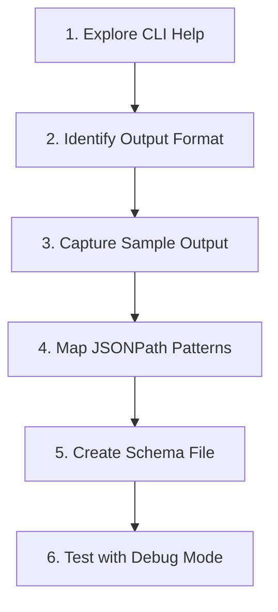

# Schema Creation Guide

Step-by-step workflow for creating headless adapter schemas for CLI coding agents.

## Overview

The headless adapter transforms any CLI agent with JSON output into a protocol-compatible adapter. You just need a schema file describing how to interact with the CLI.

## Workflow



### Step 1: Explore CLI Help

Start by examining the CLI's options for non-interactive execution:

```bash
# Main help
<agent> --help

# Subcommand help (if applicable)
<agent> exec --help
<agent> run --help
```

**Key flags to identify:**

| Purpose | Common Flags | Notes |
|---------|--------------|-------|
| Prompt input | `-p`, `--prompt`, `--message`, positional | How to pass the prompt |
| Output format | `--output-format`, `-o`, `--json` | JSON streaming mode |
| Auto-approve | `--auto`, `--skip-permissions`, `--force` | Non-interactive mode |
| Working directory | `--cwd`, `--directory`, `-C` | Project context |
| Session resume | `--resume`, `--session-id`, `-s` | Multi-turn support |

### Step 2: Identify Output Format

Most modern agents support JSON streaming. Look for:

- `stream-json` - Newline-delimited JSON objects
- `json` - Single JSON response or NDJSON
- `stream-jsonrpc` - JSON-RPC framing

**Example from Droid CLI:**
```bash
droid exec --help
# Options:
#   -o, --output-format <format>  Output format (default: "text")
#   ...
```

### Step 3: Capture Sample Output

Run a simple prompt and capture the JSON structure:

```bash
# Capture raw output
AGENT_API_KEY=... <agent> exec -o stream-json "Say hello" > output.jsonl

# Or pipe to jq for formatting
AGENT_API_KEY=... <agent> exec -o stream-json "Say hello" | jq -c '.'
```

**Expected patterns:**

```json
{"type": "message", "content": "Hello!"}
{"type": "tool_use", "name": "Read", "input": {...}}
{"type": "tool_result", "name": "Read", "output": "..."}
{"type": "result", "content": "Task completed"}
```

### Step 4: Map JSONPath Patterns

Analyze the output to create event mappings:

| JSON Event | Event Type | Extract Fields |
|------------|---------------|----------------|
| `{"type": "message", ...}` | `message` | `$.content` |
| `{"type": "tool_use", ...}` | `tool_call` | `$.name` (title), `"pending"` (status), `$.input` (input) |
| `{"type": "tool_result", ...}` | `tool_call` | `$.name` (title), `"completed"` (status), `$.content` (output) |
| `{"type": "result", ...}` | result detection | `$.content` |

**Supported JSONPath syntax:**

| Pattern | Description |
|---------|-------------|
| `$.field` | Top-level field |
| `$.nested.field` | Nested field access |
| `$.array[0].field` | Array index access |
| `$.array[*]` | Array wildcard (iterate all items) |
| `$.array[*].field` | Array wildcard with field access |
| `'literal'` | Static string value |

**Unsupported JSONPath syntax** (silently returns `undefined`):

| Pattern | Issue | Use Instead |
|---------|-------|-------------|
| `$.array[?(@.type=='x')]` | Filter expressions not supported | Wildcard match `[*]` + item-relative extract |
| `$..field` | Recursive descent not supported | Explicit path to field |
| `$.array[0,1]` | Multi-index not supported | Separate mappings or `[*]` |

#### Extract Fields Reference

The `extract` object maps JSONPath expressions to `ParsedUpdate` fields. These five fields are consumed by the output parser:

| Field | Type Coercion | Purpose | Used By |
|-------|---------------|---------|---------|
| `content` | `→ string` | Main text content | message, thought |
| `title` | `→ string` | Tool name / identifier | tool_call |
| `status` | `→ string` | Tool status (`'pending'`, `'completed'`) | tool_call |
| `input` | preserved as object | Tool input arguments | tool_call |
| `output` | preserved as object | Tool result content | tool_call (on completion) |

**Key difference:** `input` and `output` preserve native types (objects, arrays, strings) for downstream grader inspection. The other three fields coerce values to strings.

Additional string-valued fields (e.g., `toolName`, `mcpServer`) are allowed and preserved during schema validation but are not consumed by the parser.

#### Array Wildcard Matching

When tool events are nested in arrays, use `[*]` in the **match** path. Extract paths are then **relative to the matched item**, not the root event:

```json
{
  "match": { "path": "$.message.content[*].type", "value": "tool_use" },
  "emitAs": "tool_call",
  "extract": {
    "title": "$.name",
    "input": "$.input"
  }
}
```

Given `{"message": {"content": [{"type": "tool_use", "name": "Read", "input": {...}}]}}`:
- Match iterates `content[]`, finds item with `type == "tool_use"`
- Extract evaluates `$.name` against that **item** → `"Read"`
- Extract evaluates `$.input` against that **item** → `{...}` (preserved as object)

### Step 5: Create Schema File

Create a new schema file for your agent using the template below. Adapt the command, flags, and JSONPath patterns to match your CLI's output:

```json
{
  "version": 1,
  "name": "my-agent-headless",
  "command": ["my-agent", "exec"],
  "sessionMode": "stream",
  "prompt": { "flag": "-p" },
  "output": { "flag": "-o", "value": "stream-json" },
  "autoApprove": ["--auto", "high"],
  "cwdFlag": "--cwd",
  "resume": { "flag": "-s", "sessionIdPath": "$.session_id" },
  "outputEvents": [
    {
      "match": { "path": "$.type", "value": "message" },
      "emitAs": "message",
      "extract": { "content": "$.content" }
    },
    {
      "match": { "path": "$.type", "value": "tool_use" },
      "emitAs": "tool_call",
      "extract": { "title": "$.name", "status": "'pending'", "input": "$.input" }
    },
    {
      "match": { "path": "$.type", "value": "tool_result" },
      "emitAs": "tool_call",
      "extract": { "title": "$.name", "status": "'completed'", "output": "$.content" }
    }
  ],
  "result": {
    "matchPath": "$.type",
    "matchValue": "result",
    "contentPath": "$.content"
  }
}
```

### Step 6: Test with Headless

Run the headless adapter with your schema:

```bash
# Test the adapter
AGENT_API_KEY=... bunx @plaited/agent-eval-harness headless --schema ./my-agent-headless.json
```

### Step 7: Test with Debug Mode

Use debug mode to verify JSONPath extraction:

```bash
AGENT_API_KEY=... bunx @plaited/agent-eval-harness headless --schema ./my-agent-headless.json --debug
```

Debug mode shows:
- Raw CLI output lines
- JSONPath match attempts
- Extracted values for each event

## Schema Field Reference

### Required Fields

| Field | Type | Description |
|-------|------|-------------|
| `version` | `1` | Schema version (always 1) |
| `name` | string | Unique schema identifier |
| `command` | string[] | CLI command and subcommands |
| `sessionMode` | `"stream"` \| `"iterative"` | Process lifecycle mode |
| `prompt` | object | How to pass prompt text |
| `output` | object | Output format flags |
| `outputEvents` | array | Event mapping rules |
| `result` | object | Final result detection |

### Optional Fields

| Field | Type | Description |
|-------|------|-------------|
| `autoApprove` | string[] | Flags for non-interactive mode (see [Security](#security-autoapprove)) |
| `cwdFlag` | string | Working directory flag |
| `resume` | object | Session resume configuration |
| `historyTemplate` | string | Template for iterative mode |

### Session Modes

| Mode | When to Use |
|------|-------------|
| `stream` | CLI keeps process alive for multi-turn via stdin |
| `iterative` | CLI is stateless; new process per turn |

### Security: autoApprove {#security-autoapprove}

The `autoApprove` field bypasses the agent's safety confirmation prompts. Choose the **least permissive** option:

| Approach | Example | Risk |
|----------|---------|------|
| Scoped tools | `["--allowedTools", "Read,Write"]` | Low — only named tools |
| Read-only | `["--auto-approve", "read-only"]` | Low — no writes |
| Full bypass | `["--dangerously-skip-permissions"]` | High — all tools, no confirmation |

**Full bypass flags should only be used in isolated environments** (Docker containers, ephemeral CI runners, `--workspace-dir` sandboxes). Never run them against production filesystems or shared workspaces.

## CLI Documentation Links

> **7 of 8 agents compatible.** The headless adapter requires JSON streaming output.

| Agent | JSON Output Flag | Prompt Flag | CLI Documentation |
|-------|------------------|-------------|-------------------|
| Amp | `--stream-json` | `-x` | [ampcode.com/manual#cli](https://ampcode.com/manual#cli) |
| Codex | `--json` | positional | [developers.openai.com/codex/cli](https://developers.openai.com/codex/cli/) |
| Cursor | `--output-format stream-json --print` | `-p` | [cursor.com/docs/cli/reference/output-format](https://cursor.com/docs/cli/reference/output-format) |
| Droid | `-o stream-json` | positional | [docs.factory.ai/cli/droid-exec/overview](https://docs.factory.ai/cli/droid-exec/overview) |
| Goose | `--output-format stream-json` | `-t` | [block.github.io/goose/.../goose-cli-commands](https://block.github.io/goose/docs/guides/goose-cli-commands/) |
| Letta | `--output-format stream-json` | `-p` | [docs.letta.com/letta-code/cli-reference](https://docs.letta.com/letta-code/cli-reference/) |
| OpenCode | `--format json` | positional | [opencode.ai/docs/cli](https://opencode.ai/docs/cli/) |

**Not yet compatible:** [Copilot CLI](https://docs.github.com/en/copilot/concepts/agents/about-copilot-cli) (no JSON output)

## Troubleshooting

### Common Issues

| Issue | Solution |
|-------|----------|
| Timeout waiting for result | Check `result.matchPath/matchValue` matches actual output |
| No updates received | Verify `outputEvents` patterns match JSON structure |
| Process exits immediately | Check `command` includes all required subcommands |
| Authentication errors | Verify API key environment variable is set |

### Debugging Tips

**1. Capture raw CLI output to analyze:**
```bash
# Capture raw CLI output to analyze
<agent> exec -o stream-json "Test prompt" 2>&1 | tee raw-output.jsonl

# Pretty-print for analysis
cat raw-output.jsonl | jq '.'
```

**2. Debug headless adapter directly:**
```bash
# Test initialize and session creation
printf '{"jsonrpc":"2.0","id":1,"method":"initialize","params":{"protocolVersion":1}}\n{"jsonrpc":"2.0","id":2,"method":"session/new","params":{}}\n' | \
  bunx @plaited/agent-eval-harness headless --schema ./my-schema.json 2>&1
```

**3. Common JSONPath issues:**

| Path | Issue | Fix |
|------|-------|-----|
| `$.content[0].text` | Array indexing not working | Verify JSONPath impl supports `[0]` |
| `$.message.content` | Returns object, not string | Add `[0].text` for array access |
| `$.result` | No match | Check actual JSON has `type: "result"` |

**4. Test JSONPath extraction manually:**
```bash
# Parse actual agent output
echo '{"type":"assistant","message":{"content":[{"type":"text","text":"Hello"}]}}' | \
  jq '.message.content[0].text'
# Expected: "Hello"
```
