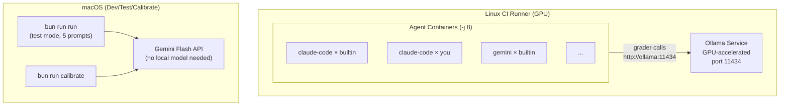

# CI Spec: Linux GPU Runner for Eval Suite

## Goals

1. Run full evaluations (151 prompts × 8 scenarios) and trials (k=5-10) on CI
2. Use a local GPU model for grading to eliminate Gemini Flash API latency (~13s → ~1-2s per prompt)
3. Keep local macOS workflow unchanged for dev, test, and calibration
4. Same `bun run run`, `bun run trials`, `bun run calibrate` commands work in both environments

## Architecture



## Environment Detection

The inline grader should auto-detect which backend to use:

| Environment Variable | Value | Grader Backend |
|---------------------|-------|----------------|
| `GRADER_BACKEND` | `ollama` | Local Ollama (CI) |
| `GRADER_BACKEND` | `gemini` | Gemini Flash API (current) |
| `GRADER_BACKEND` | unset | Auto: Ollama if reachable, else Gemini |
| `GEMINI_API_KEY` | unset | Deterministic-only (no LLM, max 70/100) |

**Auto-detection logic:**
1. Check if `GRADER_BACKEND=ollama` → use Ollama
2. Check if `GRADER_BACKEND=gemini` → use Gemini Flash
3. Probe `http://ollama:11434/api/tags` (Docker network) or `http://localhost:11434/api/tags` (host)
4. If reachable → use Ollama
5. Fall back to Gemini Flash API

## CI Runner Requirements

### Hardware

| Component | Minimum | Recommended |
|-----------|---------|-------------|
| GPU | NVIDIA T4 (16GB VRAM) | NVIDIA A10G (24GB VRAM) |
| RAM | 32GB | 64GB |
| CPU | 8 cores | 16 cores |
| Disk | 50GB SSD | 100GB SSD |

### Software

- Docker with NVIDIA Container Toolkit (`nvidia-docker2`)
- Docker Compose v2
- Bun >= 1.2.9

### Model Selection

For the grading task (classify output quality, return JSON with 4 scores):

| Model | VRAM | Speed (T4) | Quality | Recommendation |
|-------|------|------------|---------|----------------|
| `qwen2.5:7b` | ~5GB | ~1-2s | Good | Default for CI |
| `llama3.1:8b` | ~5GB | ~1-2s | Good | Alternative |
| `gemma2:9b` | ~6GB | ~1-2s | Good | Alternative |
| `qwen2.5:14b` | ~10GB | ~2-4s | Better | If A10G available |

The grading prompt is simple (score 0-30 across 4 dimensions, return JSON). A 7B model is sufficient.

## Docker Compose Changes

### CI Override File: `docker-compose.ci.yml`

```yaml
# Extends docker-compose.yml for CI with GPU-accelerated grading
services:
  ollama:
    image: ollama/ollama:latest
    deploy:
      resources:
        reservations:
          devices:
            - driver: nvidia
              count: 1
              capabilities: [gpu]
    volumes:
      - ollama-models:/root/.ollama
    ports:
      - "11434:11434"
    healthcheck:
      test: ["CMD", "curl", "-f", "http://localhost:11434/api/tags"]
      interval: 10s
      timeout: 5s
      retries: 5

  # Override agent containers to set grader backend
  gemini:
    environment:
      - GRADER_BACKEND=ollama
      - OLLAMA_HOST=http://ollama:11434
    depends_on:
      ollama:
        condition: service_healthy

  claude-code:
    environment:
      - GRADER_BACKEND=ollama
      - OLLAMA_HOST=http://ollama:11434
    depends_on:
      ollama:
        condition: service_healthy

  droid:
    environment:
      - GRADER_BACKEND=ollama
      - OLLAMA_HOST=http://ollama:11434
    depends_on:
      ollama:
        condition: service_healthy

  codex:
    environment:
      - GRADER_BACKEND=ollama
      - OLLAMA_HOST=http://ollama:11434
    depends_on:
      ollama:
        condition: service_healthy

volumes:
  ollama-models:
```

### Usage

```bash
# CI: Full run with local GPU grading
docker compose -f docker-compose.yml -f docker-compose.ci.yml up ollama -d
docker compose -f docker-compose.yml -f docker-compose.ci.yml exec ollama ollama pull qwen2.5:7b
bun run run:full -- -j 8 --prompt-concurrency 8

# Local: Unchanged (uses Gemini Flash API)
bun run run
bun run calibrate
```

## Inline Grader Changes

### Grader Backend Abstraction

The grader should support multiple LLM backends behind a common interface:

```typescript
type LlmBackend = {
  generate: (prompt: string) => Promise<string>
  name: string
}
```

**Backends:**
1. `gemini` — Current `GoogleGenAI` implementation (API call)
2. `ollama` — OpenAI-compatible API at `OLLAMA_HOST` endpoint
3. `none` — Skip LLM scoring (deterministic-only, max 70/100)

### Environment Variables

| Variable | Default | Description |
|----------|---------|-------------|
| `GRADER_BACKEND` | auto-detect | `ollama`, `gemini`, or `none` |
| `OLLAMA_HOST` | `http://ollama:11434` | Ollama endpoint (Docker service name) |
| `OLLAMA_MODEL` | `qwen2.5:7b` | Model to use for grading |
| `GEMINI_API_KEY` | (required for gemini) | Gemini Flash API key |

## CI Pipeline

### GitHub Actions Example

```yaml
name: Full Evaluation Run
on:
  schedule:
    - cron: '0 2 * * 1'  # Weekly Monday 2am
  workflow_dispatch:

jobs:
  evaluate:
    runs-on: [self-hosted, gpu]
    steps:
      - uses: actions/checkout@v4

      - uses: oven-sh/setup-bun@v2
        with:
          bun-version: latest

      - name: Install dependencies
        run: bun install

      - name: Start Ollama
        run: |
          docker compose -f docker-compose.yml -f docker-compose.ci.yml up ollama -d
          docker compose -f docker-compose.yml -f docker-compose.ci.yml exec ollama ollama pull qwen2.5:7b
          # Wait for model to be ready
          until curl -s http://localhost:11434/api/tags | grep -q qwen2.5; do sleep 2; done

      - name: Build agent containers
        run: bun run build

      - name: Run full evaluation
        run: bun run run:full -- -j 8 --prompt-concurrency 8
        env:
          ANTHROPIC_API_KEY: ${{ secrets.ANTHROPIC_API_KEY }}
          GEMINI_API_KEY: ${{ secrets.GEMINI_API_KEY }}
          YDC_API_KEY: ${{ secrets.YDC_API_KEY }}
          OPENAI_API_KEY: ${{ secrets.OPENAI_API_KEY }}

      - name: Run comparisons
        run: |
          bun scripts/compare.ts --mode full
          bun scripts/compare.ts --mode full --strategy statistical

      - name: Generate summary
        run: bun run summarize:full

      - name: Upload results
        uses: actions/upload-artifact@v4
        with:
          name: eval-results-${{ github.run_id }}
          path: |
            data/results/runs/
            data/comparisons/runs/

      - name: Cleanup
        if: always()
        run: docker compose -f docker-compose.yml -f docker-compose.ci.yml down -v
```

## Performance Projections

### Full Run (151 prompts × 8 scenarios)

| Config | Grader | Container `-j` | Prompt `-j` | Est. Time |
|--------|--------|----------------|-------------|-----------|
| macOS (current) | Gemini API (13s) | unlimited | 8 | ~35 min |
| CI GPU | Ollama 7B (~2s) | 8 | 8 | ~3-5 min |
| CI GPU, no grader | none | 8 | 8 | ~2-3 min |

### Trials (151 prompts × k=5 × 8 scenarios)

| Config | Grader | Container `-j` | Est. Time |
|--------|--------|----------------|-----------|
| macOS (current) | Gemini API | 4 | ~60-90 min |
| CI GPU | Ollama 7B | 8 | ~15-25 min |

## Local Development Unchanged

Nothing changes for local workflow:

```bash
# These all work exactly as before (Gemini Flash API)
bun run run              # Test mode, 5 prompts
bun run calibrate        # Interactive grader calibration
bun run compare:test-weighted
bun run summarize:test

# GRADER_BACKEND not set → auto-detects → no Ollama → falls back to Gemini
```

## Implementation Phases

### Phase 1: Grader Backend Abstraction

Modify `scripts/inline-grader.ts` to support pluggable LLM backends:
- Add `GRADER_BACKEND` / `OLLAMA_HOST` / `OLLAMA_MODEL` env var support
- Implement Ollama backend using `fetch` to OpenAI-compatible API
- Keep Gemini as default fallback
- No changes to scoring logic or prompt template

### Phase 2: CI Docker Infrastructure

- Create `docker-compose.ci.yml` override file
- Add Ollama service with GPU reservation and healthcheck
- Add `GRADER_BACKEND=ollama` to agent service overrides
- Test locally with `docker compose -f ... -f ... up`

### Phase 3: CI Pipeline

- Add GitHub Actions workflow for scheduled full runs
- Configure self-hosted GPU runner
- Add artifact upload for results
- Add Slack/email notification on completion

### Phase 4: Grader Quality Validation

- Run same prompts through both Gemini Flash and Ollama 7B
- Compare score distributions (should be similar)
- Calibrate with `bun run calibrate` against both backends
- Adjust model choice if quality degrades
