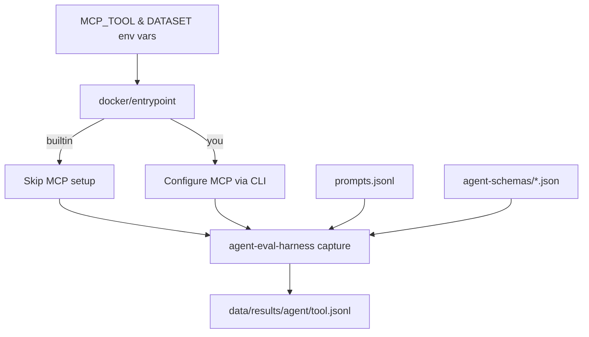

# Agentic Web Search Playoffs

Evaluate multiple agents (Claude Code, Gemini, Droid, Codex) with different web search tools (builtin, You.com MCP) in isolated Docker containers.

## Overview

The **playoffs** system runs a matrix evaluation: 4 agents × 2 tools = 8 pairings, capturing full trajectories for comparison.

**Key Features:**
- **Headless adapters** - No custom code, just JSON schemas ([@plaited/agent-eval-harness](https://www.npmjs.com/package/@plaited/agent-eval-harness))
- **Flag-based architecture** - Single service per agent, MCP mode selected via environment variable
- **Type-safe constants** - MCP server definitions in `mcp-servers.ts`
- **TypeScript entrypoint** - Bun shell script for runtime MCP configuration
- **Isolated execution** - Each pairing runs in its own Docker container



## Quick Start

### 1. Install Dependencies

```bash
bun install
```

### 2. Set API Keys

Create `.env` file (gitignored):

```bash
cp .env.example .env
nano .env
```

Required keys:
- `ANTHROPIC_API_KEY` - Claude Code agent
- `GEMINI_API_KEY` - Gemini agent + inline grader LLM scoring
- `FACTORY_API_KEY` - Droid agent
- `OPENAI_API_KEY` - Codex agent
- `YOU_API_KEY` - You.com MCP tool

### 3. Run Evaluations

#### Test Workflow (5 prompts, ~5 minutes)

```bash
# Run all agents in parallel (8 scenarios: 4 agents × 2 tools)
bun run run

# Or run specific agent+tool combinations
docker compose run --rm -e MCP_TOOL=builtin claude-code
docker compose run --rm -e MCP_TOOL=you gemini
```

#### Full Workflow (1,254 prompts, ~10+ hours)

```bash
# Run all agents with full dataset
bun run run:full
```

### 4. Analyze Results

Compare results using the flexible CLI tool:

```bash
# Default: all agents, test mode, weighted strategy
bun scripts/compare.ts

# Compare full dataset
bun scripts/compare.ts --mode full

# Filter by agent or MCP mode
bun scripts/compare.ts --agent gemini --agent claude-code
bun scripts/compare.ts --mcp builtin

# Use statistical strategy
bun scripts/compare.ts --strategy statistical

# Combine flags
bun scripts/compare.ts --mode full --mcp you --strategy statistical

# Preview configuration
bun scripts/compare.ts --dry-run
```

Or use npm shortcuts for common test data comparisons:

```bash
bun run compare:all-weighted        # All agents, both modes
bun run compare:all-statistical     # Statistical analysis
bun run compare:builtin-agents      # Builtin only
bun run compare:you-agents          # MCP only
```

View results:

```bash
cat data/comparison-all-weighted-test.json | jq '.meta, .quality'
cat data/comparison-all-weighted-test.json | jq '.headToHead.pairwise'
```

## Pass@k Analysis

Run multiple trials per prompt to measure agent reliability:

```bash
# Default: Droid agent, test set, k=5
bun run trials

# Capability exploration (k=10)
bun run trials:capability

# Regression safety (k=3, faster)
bun run trials:regression

# Custom: specify agent and k value
bun run trials -- --agent gemini -k 7

# View metrics
cat data/results/trials/droid-test.jsonl | jq '{id, passRate, passAtK, passExpK}'
```

**Metrics:** `passAtK` = capability (can do task?), `passExpK` = reliability (always succeeds?)

## Architecture

### Agent Schemas (agent-schemas/)

Headless adapter schemas - no custom code, just JSON configuration:

| Schema | Agent | Mode | Status |
|--------|-------|------|--------|
| `claude-code.json` | Claude Code | stream | ✅ Tested |
| `gemini.json` | Gemini CLI | iterative | ✅ Tested |
| `droid.json` | Droid CLI | stream | ✅ Tested |
| `codex.json` | Codex CLI | stream | ✅ Tested |

**Session Modes:**
- **stream**: Process stays alive, multi-turn via stdin
- **iterative**: New process per turn, history accumulated

### MCP Configuration (mcp-servers.ts)

Single source of truth for MCP server configurations. The TypeScript entrypoint (`docker/entrypoint`) imports these constants and configures agents at runtime via their official CLI commands.

**Available Tools:**
- `builtin` - Agent's native search (no MCP config)
- `you` - You.com MCP server (requires `YOU_API_KEY`)

To add new MCP tools, see `.claude/skills/playoffs/references/mcp-tools.md`.

### CLI Scripts (scripts/)

| Script | Purpose |
|--------|---------|
| `run.ts` | Automated test runner (4 agents × 2 tools in parallel) |
| `compare.ts` | Flexible comparison tool with mode/agent/strategy flags |
| `run-trials.ts` | Multi-trial wrapper for pass@k/pass^k analysis |
| `inline-grader.ts` | Hybrid grader (deterministic + LLM scoring) |

See "Analyze Results" in Quick Start for comparison usage examples.

### Docker Infrastructure

Isolated execution for reproducibility:

```
docker/
├── base.Dockerfile           # Shared base (Bun + Node 24)
├── claude-code.Dockerfile
├── gemini.Dockerfile
├── droid.Dockerfile
├── codex.Dockerfile
├── entrypoint                # TypeScript entrypoint (Bun shell)
└── docker-compose.yml        # 4 services (one per agent)
```

The entrypoint script:
1. Reads `MCP_TOOL` environment variable (`builtin` or `you`)
2. Reads `DATASET` environment variable (`test` or `full`)
3. Configures MCP via agent CLI if needed (skips for `builtin`)
4. Runs `@plaited/agent-eval-harness capture` with appropriate prompts

## Prompts

| File | Prompts | Format | Use With |
|------|---------|--------|----------|
| `test.jsonl` | 5 | `<web-search>` | Builtin |
| `test-mcp.jsonl` | 5 | `<web-search mcp-server="ydc-server">` | MCP |
| `full.jsonl` | 1,254 | `<web-search>` | Builtin |
| `full-mcp.jsonl` | 1,254 | `<web-search mcp-server="ydc-server">` | MCP |

Prompts are designed to trigger web search with time-sensitive queries and recent events.

## Results

Results are written to `data/results/<agent>/<tool>[-<dataset>].jsonl`:

**Naming convention:**
- Test mode: `<tool>-test.jsonl` (e.g., `builtin-test.jsonl`)
- Full mode: `<tool>.jsonl` (e.g., `builtin.jsonl`, no suffix)

```
data/results/
├── claude-code/
│   ├── builtin-test.jsonl    # Test dataset
│   ├── builtin.jsonl         # Full dataset
│   ├── you-test.jsonl        # Test dataset
│   └── you.jsonl             # Full dataset
├── gemini/
│   ├── builtin-test.jsonl
│   ├── builtin.jsonl
│   ├── you-test.jsonl
│   └── you.jsonl
├── droid/
│   ├── builtin-test.jsonl
│   ├── builtin.jsonl
│   ├── you-test.jsonl
│   └── you.jsonl
└── codex/
    ├── builtin-test.jsonl
    ├── builtin.jsonl
    ├── you-test.jsonl
    └── you.jsonl
```

Each result includes full trajectory (messages, tool calls, timing, token usage).

## Inline Grader

The project uses a hybrid grading approach in `scripts/inline-grader.ts`:
- **Deterministic (60%)** - Checks for hint content, proper formatting
- **LLM (40%)** - Gemini Flash 2.0 for semantic quality scoring

The grader runs inline during evaluation via the `--grader` flag. For detailed grading concepts (validation, calibration, best practices), see the `agent-eval-harness` skill documentation.

## Development

### Code Quality

```bash
# Type check
bun run typecheck

# Lint and format
bun run check

# Auto-fix
bun run check:write

# Run tests
bun test
```

### Adding Agents

1. **Create adapter schema** (`agent-schemas/<agent>.json`)
2. **Create Dockerfile** (`docker/<agent>.Dockerfile`)
3. **Add Docker Compose service**
4. **Update TypeScript entrypoint** (`docker/entrypoint`)

See `.claude/skills/playoffs/SKILL.md` for detailed guide.

### Adding MCP Tools

1. **Add to mcp-servers.ts**
2. **Update docker/entrypoint** (add case to `configureMcp()`)
3. **Update .env and .env.example**
4. **Update scripts/run.ts** (add to `McpTool` type)
5. **Create MCP prompt set**

See `.claude/skills/playoffs/references/mcp-tools.md` for detailed guide.

## Troubleshooting

### MCP Config Issues

```bash
# Verify API keys
cat .env | grep API_KEY

# Test inside container
docker compose run --rm -e MCP_TOOL=you claude-code bash -c "cat ~/.mcp.json"
```

### Agent Schema Issues

```bash
# Test adapter compliance
bunx @plaited/agent-eval-harness adapter:check -- \
  bunx @plaited/agent-eval-harness headless --schema agent-schemas/<agent>.json
```

### Docker Build Failures

```bash
# Check base image
docker build -t base -f docker/base.Dockerfile .
docker run --rm base bun --version

# Check agent CLI
docker build -t test-<agent> -f docker/<agent>.Dockerfile .
docker run --rm test-<agent> <agent> --version
```

## Project Structure

```
evals/
├── agent-schemas/          # Headless schemas
│   ├── claude-code.json
│   ├── gemini.json
│   ├── droid.json
│   └── codex.json
│
├── mcp-servers.ts          # MCP configuration (TypeScript constants)
│
├── scripts/                # CLI tools
│   ├── run.ts              # Automated test runner
│   ├── compare.ts          # Flexible comparison tool
│   ├── run-trials.ts       # Pass@k trials wrapper
│   └── inline-grader.ts    # Hybrid grader
│
├── docker/                 # Container infrastructure
│   ├── base.Dockerfile
│   ├── {agent}.Dockerfile  # One per agent
│   ├── entrypoint          # TypeScript entrypoint
│   └── docker-compose.yml
│
├── data/
│   ├── prompts/            # Evaluation prompts
│   └── results/            # Agent outputs (gitignored)
│
└── .claude/skills/playoffs/  # Development assistant skill
```

## Skills

This project uses [AgentSkills](https://agentskills.io) for agent-first development:

- **playoffs** - Development assistant for extending playoffs
- **agent-eval-harness** - Capture, trials, and analysis commands

See `@AGENTS.md` for development rules and conventions.

## Built With

- **[@plaited/agent-eval-harness](https://www.npmjs.com/package/@plaited/agent-eval-harness)** - Trajectory capture framework
- **[Zod](https://zod.dev)** - TypeScript-first schema validation
- **[Bun](https://bun.sh)** - Fast TypeScript runtime
- **[Docker](https://www.docker.com)** - Isolated execution
