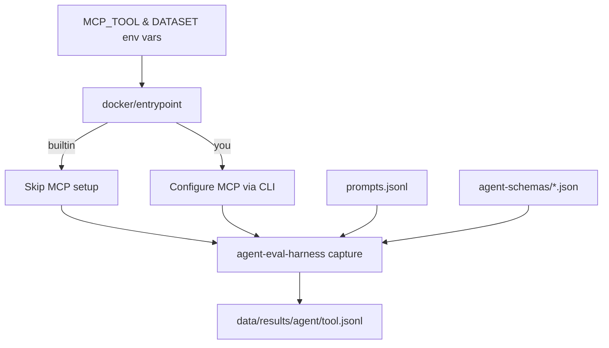

# Web Search Agent Evaluations

Evaluate multiple agents (Claude Code, Gemini, Droid, Codex) with different web search tools (builtin, You.com MCP) in isolated Docker containers.

## Overview

This evaluation system runs a matrix comparison: 4 agents × 2 tools = 8 pairings, capturing full trajectories for analysis.

**Key Features:**
- **Headless adapters** - No custom code, just JSON schemas ([@plaited/agent-eval-harness](https://www.npmjs.com/package/@plaited/agent-eval-harness))
- **Flag-based architecture** - Single service per agent, MCP mode selected via environment variable
- **Type-safe constants** - MCP server definitions in `mcp-servers.ts`
- **TypeScript entrypoint** - Bun shell script for runtime MCP configuration
- **Isolated execution** - Each pairing runs in its own Docker container



## Quick Start

### 1. Install Dependencies

```bash
bun install
```

### 2. Set API Keys

Create `.env` file (gitignored):

```bash
cp .env.example .env
nano .env
```

Required keys:
- `ANTHROPIC_API_KEY` - Claude Code agent
- `GEMINI_API_KEY` - Gemini agent + inline grader LLM scoring
- `FACTORY_API_KEY` - Droid agent
- `OPENAI_API_KEY` - Codex agent
- `YOU_API_KEY` - You.com MCP tool

### 3. Generate Test Prompts

Generate test prompts (includes MCP variants automatically):

```bash
bun run sample:test        # 5 prompts for quick testing
bun run sample:trials      # 30 prompts for pass@k analysis
```

### 4. Run Evaluations

#### Test Mode (5 prompts, ~5 minutes)

```bash
bun run run              # All agents, test dataset
bun run run:test         # Explicit test mode
```

#### Full Mode (151 prompts, ~2 hours)

```bash
bun run run:full         # All agents, full dataset
```

#### Custom Runs

```bash
# Specific agent+tool combinations via Docker
docker compose run --rm -e SEARCH_PROVIDER=builtin claude-code
docker compose run --rm -e SEARCH_PROVIDER=you gemini
```

### 5. Analyze Results

Compare agent performance using npm scripts:

```bash
# Test mode comparisons
bun run compare                     # Default: test mode, weighted
bun run compare:test                # Explicit test mode
bun run compare:test-statistical    # Statistical analysis

# Full mode comparisons
bun run compare:full                # Full dataset, weighted
bun run compare:full-statistical    # Full dataset, statistical

# Advanced: Custom filters
bun run compare -- --agent gemini --search-provider you
```

View comparison results:

```bash
cat data/comparisons/test-runs/all-weighted.json | jq '.quality'
cat data/comparisons/runs/*/all-weighted.json | jq '.headToHead.pairwise'
```

## Pass@k Analysis

Run multiple trials per prompt across all agents and search providers to measure reliability:

```bash
# Run all agents × all providers (8 combinations, k=5 each)
bun run trials                      # Default: all agents/providers, k=5

# Different trial types
bun run trials:capability           # All agents/providers, k=10 (capability exploration)
bun run trials:regression           # All agents/providers, k=3 (fast regression checks)

# Filter to specific agents or providers
bun run trials -- --agent gemini                    # Single agent, all providers
bun run trials -- --search-provider you             # All agents, MCP only
bun run trials -- --agent claude-code --search-provider builtin

# Custom k value
bun run trials -- -k 7              # All agents/providers, k=7
```

View pass@k metrics:

```bash
cat data/results/trials/2026-01-29/*/builtin.jsonl | jq '{id, passRate, passAtK, passExpK}'
cat data/results/trials/*/droid/builtin.jsonl | jq '.passRate'
```

**Metrics:**
- `passAtK` - Capability (can it do the task at all?)
- `passExpK` - Reliability (does it always succeed?)

**Output:** Results written to `data/results/trials/YYYY-MM-DD/{agent}/{provider}.jsonl`

## Architecture

### Agent Schemas (agent-schemas/)

Headless adapter schemas - no custom code, just JSON configuration:

| Schema | Agent | Mode | Status |
|--------|-------|------|--------|
| `claude-code.json` | Claude Code | stream | ✅ Tested |
| `gemini.json` | Gemini CLI | iterative | ✅ Tested |
| `droid.json` | Droid CLI | stream | ✅ Tested |
| `codex.json` | Codex CLI | stream | ✅ Tested |

**Session Modes:**
- **stream**: Process stays alive, multi-turn via stdin
- **iterative**: New process per turn, history accumulated

### MCP Configuration (mcp-servers.ts)

Single source of truth for MCP server configurations. The TypeScript entrypoint (`docker/entrypoint`) imports these constants and configures agents at runtime via their official CLI commands.

**Available Tools:**
- `builtin` - Agent's native search (no MCP config)
- `you` - You.com MCP server (requires `YOU_API_KEY`)
  - Expected tools: `you-search`, `you-express`, `you-contents`

To add new MCP tools, see `.claude/skills/web-search-agent-evals/SKILL.md`.

### CLI Scripts (scripts/)

| Script | Purpose |
|--------|---------|
| `run.ts` | Automated test runner (4 agents × 2 tools in parallel) |
| `compare.ts` | Flexible comparison tool with mode/agent/strategy flags |
| `run-trials.ts` | Multi-trial wrapper for pass@k/pass^k analysis |
| `inline-grader.ts` | Hybrid grader (deterministic + LLM scoring) |
| `calibrate.ts` | Interactive grader calibration tool |
| `generate-mcp-prompts.ts` | Generate MCP variant prompts with metadata |
| `sample.ts` | Sample prompts for test/trials datasets |

See "Analyze Results" in Quick Start for comparison usage examples.

### Docker Infrastructure

Isolated execution for reproducibility:

```
docker/
├── base.Dockerfile           # Shared base (Bun + Node 24)
├── claude-code.Dockerfile
├── gemini.Dockerfile
├── droid.Dockerfile
├── codex.Dockerfile
├── entrypoint                # TypeScript entrypoint (Bun shell)
└── docker-compose.yml        # 4 services (one per agent)
```

The entrypoint script:
1. Reads `MCP_TOOL` environment variable (`builtin` or `you`)
2. Reads `DATASET` environment variable (`test` or `full`)
3. Configures MCP via agent CLI if needed (skips for `builtin`)
4. Runs `@plaited/agent-eval-harness capture` with appropriate prompts

## Prompts

Prompts are organized by dataset type, with each dataset in its own directory containing both builtin and MCP variants:

| File | Prompts | Format | Use With |
|------|---------|--------|----------|
| `full/prompts.jsonl` | 151 | Standard | `SEARCH_PROVIDER=builtin` |
| `full/prompts-you.jsonl` | 151 | MCP variant | `SEARCH_PROVIDER=you` |
| `test/prompts.jsonl` | 5 | Standard | `SEARCH_PROVIDER=builtin` |
| `test/prompts-you.jsonl` | 5 | MCP variant | `SEARCH_PROVIDER=you` |
| `trials/prompts.jsonl` | 30 | Standard | `SEARCH_PROVIDER=builtin` |
| `trials/prompts-you.jsonl` | 30 | MCP variant | `SEARCH_PROVIDER=you` |

**Test and trials prompts** are randomly sampled from the full dataset. All prompts use unified "Use web search to find:" format. MCP variants add metadata (`mcpServer`, `expectedTools`) without changing prompt text.

**Metadata structure** (MCP variants only):
```json
{
  "mcpServer": "ydc-server",
  "expectedTools": ["you-search", "you-express", "you-contents"]
}
```

**Regenerate prompts:**

```bash
bun run sample:test        # 5 prompts → data/prompts/test/
bun run sample:trials      # 30 prompts → data/prompts/trials/
```

All prompts are designed to trigger web search with time-sensitive queries and recent events.

## Results

Results are organized into two tiers:

### Test Results (Rapid Iteration)
Quick development cycles, not versioned:
```
data/results/test-runs/
├── claude-code/
│   ├── builtin.jsonl
│   └── you.jsonl
├── gemini/
├── droid/
└── codex/
```

### Full Runs (Historical Archive)
Dated snapshots for long-term analysis:
```
data/results/
└── runs/
    ├── 2026-01-24/
    │   ├── claude-code/
    │   │   ├── builtin.jsonl
    │   │   └── you.jsonl
    │   ├── gemini/
    │   ├── droid/
    │   └── codex/
    └── 2026-02-15/
```

**Versioning:** Each full run is committed with a dated directory.

**Compare runs:**
```bash
bun run compare:full                # Latest full run
```

Each result includes full trajectory (messages, tool calls, timing, token usage).

## Comparisons

Comparison analyses are versioned alongside the raw results they evaluate.

### Comparison Metrics

Each comparison output includes:

**Quality Metrics (per agent+tool pairing):**
- `avgScore` - Mean inline grader score (0-1 scale)
- `passRate` - Percentage of prompts that passed (score ≥ 0.7)
- `passCount` / `failCount` - Number of passing/failing prompts
- `scoreDistribution` - Histogram of scores by quintile

**Performance Metrics:**
- `latency.p50/p90/p99` - Response time percentiles (milliseconds)
- `firstResponse` - Time to first output
- `totalDuration` - Total execution time across all prompts

**Head-to-Head Analysis:**
- Pairwise win/loss/tie records
- Statistical significance (when using `--strategy statistical`)

### Comparison Strategies

**Weighted Strategy (default):**
Balances multiple dimensions with configurable weights:
- `COMPARE_QUALITY` (default: 0.6) - Inline grader scores
- `COMPARE_LATENCY` (default: 0.3) - Response speed
- `COMPARE_RELIABILITY` (default: 0.1) - Pass rate consistency

**Statistical Strategy:**
Uses bootstrap sampling (1000 iterations by default) to compute:
- Confidence intervals for mean scores
- Statistical significance testing (p<0.05)
- Reduces false conclusions from small sample sizes

Configure via `COMPARE_BOOTSTRAP_ITERATIONS` environment variable.

### Output Structure

```
data/comparisons/test-runs/       # Test mode comparisons
├── all-weighted.json             # All agents, both tools
├── all-statistical.json          # Statistical analysis
├── builtin-weighted.json         # Builtin tool only
└── you-weighted.json             # MCP tool only

data/comparisons/runs/            # Full mode comparisons
└── 2026-01-24/
    ├── all-weighted.json
    ├── all-statistical.json
    └── ...
```

### View Comparison Results

```bash
# Quality rankings and performance metrics
jq '.quality' data/comparisons/runs/*/all-weighted.json
jq '.performance' data/comparisons/test-runs/all-weighted.json

# Head-to-head win rates
jq '.headToHead.pairwise' data/comparisons/test-runs/all-statistical.json
```

## Inline Grader

The project uses a hybrid grading approach in `scripts/inline-grader.ts` that evaluates agent responses on a 100-point scale.

### Scoring Breakdown (100 points total)

**Deterministic Scoring (70 points maximum):**
- **10 pts** - Basic output: Has substantial content (≥40 characters)
- **25 pts** - Tool usage: Called correct tool (partial credit for wrong tool if MCP expected)
- **25 pts** - Clean execution: No errors or timeouts
- **10 pts** - Sources bonus: Includes URLs or source references

**LLM Scoring (30 points maximum):**
Uses Gemini Flash 3.0 to evaluate search result quality:
- **0-15 pts** - Query match: Does it answer the search query?
- **0-5 pts** - Source evidence: Are sources/URLs cited?
- **0-5 pts** - Content substance: Specific info or generic fluff?
- **0-5 pts** - Format quality: Well-organized structure?

**Pass Threshold:** 65/100 (normalized score ≥ 0.65)

**Automatic Failures:**
- Execution timeouts → score 0
- Tool execution errors → score 0

**Fallback Mode:** Works without `GEMINI_API_KEY` (deterministic-only, max 60 points)

### MCP Tool Detection

The grader tracks whether agents used the expected MCP tools by checking trajectory metadata:
- **Claude Code**: Detects `mcp__<server>__<tool>` format
- **Codex**: Checks `mcpServer` field in trajectory
- **DROID**: Detects `<server>___<tool>` format (triple underscore)
- **GEMINI**: Matches tool names against expected tools list

This metadata enables analysis of tool selection patterns (e.g., Express vs. Search usage).

### Calibration

The LLM component may hallucinate facts. Always:
- Review sampled failures manually before trusting scores
- Use `bunx @plaited/agent-eval-harness calibrate` to validate grader accuracy
- Check for systematic biases in LLM scoring

For detailed grading concepts (validation, calibration, best practices), see the `agent-eval-harness` skill documentation.

## Development

### Code Quality

```bash
# Type check
bun run typecheck

# Lint and format
bun run check

# Auto-fix
bun run check:write

# Run tests
bun test
```

### Adding Agents

1. **Create adapter schema** (`agent-schemas/<agent>.json`)
2. **Create Dockerfile** (`docker/<agent>.Dockerfile`)
3. **Add Docker Compose service**
4. **Update TypeScript entrypoint** (`docker/entrypoint`)

See `.claude/skills/web-search-agent-evals/SKILL.md` for detailed guide.

### Adding MCP Tools

1. **Add to mcp-servers.ts** - Define server configuration with name, URL, auth, and expectedTools
2. **Update docker/entrypoint** - Add case to `configureMcp()` function for each agent CLI
3. **Update .env and .env.example** - Add required API keys
4. **Sample test prompts** - Run `bun run sample:test` to include new MCP variants

See `.claude/skills/web-search-agent-evals/SKILL.md` for detailed guide.

**Note:** All scripts automatically pick up new MCP servers from `mcp-servers.ts`.

## Troubleshooting

### MCP Config Issues

```bash
# Verify API keys
cat .env | grep API_KEY

# Test inside container
docker compose run --rm -e MCP_TOOL=you claude-code bash -c "cat ~/.mcp.json"
```

### Agent Schema Issues

```bash
# Test adapter compliance
bunx @plaited/agent-eval-harness adapter:check -- \
  bunx @plaited/agent-eval-harness headless --schema agent-schemas/<agent>.json
```

### Docker Build Failures

```bash
# Check base image
docker build -t base -f docker/base.Dockerfile .
docker run --rm base bun --version

# Check agent CLI
docker build -t test-<agent> -f docker/<agent>.Dockerfile .
docker run --rm test-<agent> <agent> --version
```

## Project Structure

```
evals/
├── agent-schemas/          # Headless schemas
│   ├── claude-code.json
│   ├── gemini.json
│   ├── droid.json
│   └── codex.json
│
├── mcp-servers.ts          # MCP configuration (TypeScript constants)
│
├── scripts/                # CLI tools
│   ├── run.ts              # Automated test runner
│   ├── compare.ts          # Flexible comparison tool
│   ├── run-trials.ts       # Pass@k trials wrapper
│   ├── inline-grader.ts    # Hybrid grader
│   ├── calibrate.ts        # Grader calibration tool
│   ├── generate-mcp-prompts.ts  # MCP variant generator
│   └── sample.ts           # Prompt sampler
│
├── docker/                 # Container infrastructure
│   ├── base.Dockerfile
│   ├── {agent}.Dockerfile  # One per agent
│   ├── entrypoint          # TypeScript entrypoint
│   └── docker-compose.yml
│
├── data/
│   ├── prompts/            # Evaluation prompts
│   └── results/            # Agent outputs (gitignored)
│
└── .claude/skills/web-search-agent-evals/  # Development assistant skill
```

## Skills

This project uses [AgentSkills](https://agentskills.io) for agent-first development:

- **web-search-agent-evals** - Development assistant for this evaluation system
- **agent-eval-harness** - Capture, trials, and analysis commands

See `@AGENTS.md` for development rules and conventions.

## Built With

- **[@plaited/agent-eval-harness](https://www.npmjs.com/package/@plaited/agent-eval-harness)** - Trajectory capture framework
- **[Zod](https://zod.dev)** - TypeScript-first schema validation
- **[Bun](https://bun.sh)** - Fast TypeScript runtime
- **[Docker](https://www.docker.com)** - Isolated execution
