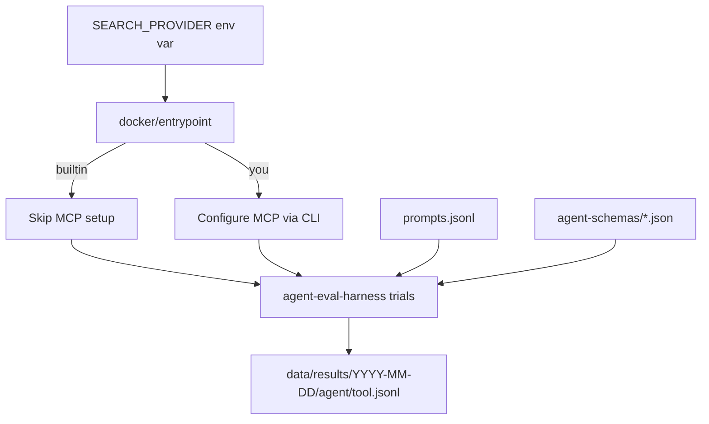
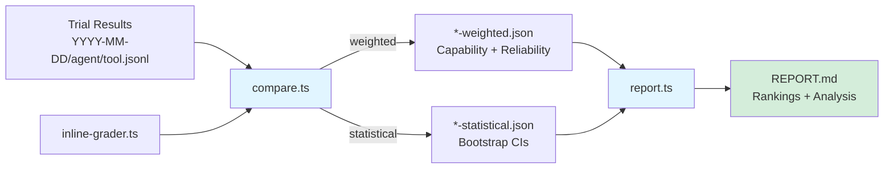

# Web Search Agent Evaluations

Evaluate multiple agents (Claude Code, Gemini, Droid, Codex) with different web search tools (builtin, You.com MCP) in isolated Docker containers.

## Overview

This evaluation system runs a matrix comparison: 4 agents × 2 tools = 8 pairings, capturing full trajectories for analysis.

**Key Features:**
- **Headless adapters** - No custom code, just JSON schemas ([@plaited/agent-eval-harness](https://www.npmjs.com/package/@plaited/agent-eval-harness))
- **Flag-based architecture** - Single service per agent, MCP mode selected via environment variable
- **Type-safe constants** - MCP server definitions in `mcp-servers.ts`
- **TypeScript entrypoint** - Bun shell script for runtime MCP configuration
- **Isolated execution** - Each pairing runs in its own Docker container

### Evaluation Pipeline



### Analysis Pipeline



## Latest Results

📊 **[View Latest Evaluation Report](data/comparisons/2026-02-18/REPORT.md)** - Comprehensive analysis with quality rankings, performance metrics, tool call statistics, and recommendations

## Quick Start

### 1. Install Dependencies

```bash
bun install
```

### 2. Set API Keys

Create `.env` file (gitignored):

```bash
cp .env.example .env
nano .env
```

Required keys:
- `ANTHROPIC_API_KEY` - Claude Code agent
- `GEMINI_API_KEY` - Gemini agent + inline grader LLM scoring
- `FACTORY_API_KEY` - Droid agent
- `OPENAI_API_KEY` - Codex agent
- `YDC_API_KEY` - You.com MCP tool

### 3. Run Evaluations

```bash
# Full dataset (151 prompts), k=5 — all 8 agent×provider scenarios
bun run trials

# Quick smoke test (5 random prompts, single trial)
bun run trials -- --count 5 -k 1

# Specific agent or provider
bun run trials -- --agent droid --search-provider builtin

# Different trial types
bun run trials -- --trial-type capability   # k=10, deep capability exploration
bun run trials -- --trial-type regression   # k=3, fast regression check

# Control parallelism
bun run trials -- -j 4                      # Limit to 4 containers
bun run trials -- --prompt-concurrency 4    # 4 prompts per container
```

### 4. Analyze Results

Compare pass@k performance across agents:

```bash
# Run weighted comparison (latest date auto-detected)
bun run compare

# Statistical analysis with bootstrap confidence intervals
bun run compare:stat

# Specific date or agent
bun run compare -- --run-date 2026-02-18
bun run compare -- --agent droid --search-provider builtin

# Generate comprehensive REPORT.md
bun run report
```

View raw results:

```bash
cat data/comparisons/2026-02-18/all-weighted.json | jq '.capability'
cat data/results/2026-02-18/droid/builtin.jsonl | jq '{id, passRate, passAtK, passExpK}'
```

## Pass@k Analysis

Run multiple trials per prompt across all agents and search providers to measure reliability:

```bash
# Full dataset (151 prompts), k=5 — all 8 combinations
bun run trials

# Quick sample for exploration
bun run trials -- --count 5         # 5 random prompts, k=5
bun run trials -- --count 5 -k 1   # Smoke test (fastest)

# Trial type presets
bun run trials -- --trial-type capability   # k=10, deep exploration
bun run trials -- --trial-type regression   # k=3, fast regression

# Filter by agent or provider
bun run trials -- --agent gemini
bun run trials -- --search-provider you
bun run trials -- --agent claude-code --search-provider builtin

# Custom k value
bun run trials -- -k 7
```

View pass@k metrics:

```bash
cat data/results/2026-02-18/*/builtin.jsonl | jq '{id, passRate, passAtK, passExpK}'
cat data/results/2026-02-18/droid/builtin.jsonl | jq '.passRate'
```

**Metrics:**
- `passAtK` - Capability (can it do the task at all? = `1 - (1-p)^k`)
- `passExpK` - Reliability (does it always succeed? = `p^k`)

**Output:** Results written to `data/results/YYYY-MM-DD/{agent}/{provider}.jsonl`

## Architecture

### Agent Schemas (agent-schemas/)

Headless adapter schemas - no custom code, just JSON configuration:

| Schema | Agent | Mode | Status |
|--------|-------|------|--------|
| `claude-code.json` | Claude Code | stream | ✅ Tested |
| `gemini.json` | Gemini CLI | iterative | ✅ Tested |
| `droid.json` | Droid CLI | stream | ✅ Tested |
| `codex.json` | Codex CLI | stream | ✅ Tested |

**Session Modes:**
- **stream**: Process stays alive, multi-turn via stdin
- **iterative**: New process per turn, history accumulated

### MCP Configuration (mcp-servers.ts)

Single source of truth for MCP server configurations. The TypeScript entrypoint (`docker/entrypoint`) imports these constants and configures agents at runtime via their official CLI commands.

**Available Tools:**
- `builtin` - Agent's native search (no MCP config)
- `you` - You.com MCP server (requires `YDC_API_KEY`)
  - Expected tools: `you-search`, `you-express`, `you-contents`

To add new MCP tools, see `.claude/skills/web-search-agent-evals/SKILL.md`.

### CLI Scripts (scripts/)

| Script | Purpose |
|--------|---------|
| `run-trials.ts` | Run pass@k trials (`bun run trials`) — full dataset, k=5 default |
| `compare.ts` | Compare trial results across agents and providers |
| `report.ts` | Generate comprehensive `REPORT.md` from comparison data |
| `inline-grader.ts` | Hybrid grader (deterministic + LLM scoring) |
| `calibrate.ts` | Interactive grader calibration tool |
| `generate-mcp-prompts.ts` | Generate MCP variant prompts with metadata |

See "Analyze Results" in Quick Start for comparison usage examples.

### Docker Infrastructure

Isolated execution for reproducibility:

```
docker/
├── base.Dockerfile           # Shared base (Bun + Node 24)
├── claude-code.Dockerfile
├── gemini.Dockerfile
├── droid.Dockerfile
├── codex.Dockerfile
├── entrypoint                # TypeScript entrypoint (Bun shell)
└── docker-compose.yml        # 4 services (one per agent)
```

The entrypoint script:
1. Reads `SEARCH_PROVIDER` environment variable (`builtin` or `you`)
2. Configures MCP via agent CLI if needed (skips for `builtin`)
3. If `PROMPT_COUNT` is set, shuffles full prompts and samples N into a temp file
4. Runs `@plaited/agent-eval-harness trials` with the selected prompts

## Prompts

Prompts live in a single `full/` directory with builtin and MCP variants:

| File | Prompts | Format | Use With |
|------|---------|--------|----------|
| `full/prompts.jsonl` | 151 | Standard | `SEARCH_PROVIDER=builtin` |
| `full/prompts-you.jsonl` | 151 | MCP variant | `SEARCH_PROVIDER=you` |

**Builtin prompts** are plain queries. **MCP prompts** add `"Use {server-name} and answer\n"` prefix and MCP metadata (`mcpServer`, `expectedTools`).

**Metadata structure** (MCP variants only):
```json
{
  "mcpServer": "ydc-server",
  "expectedTools": ["you-search", "you-express", "you-contents"]
}
```

**To sample a subset at runtime**, use `--count N` (shuffles full dataset, no pre-generation needed):

```bash
bun run trials -- --count 5    # 5 random prompts from full dataset
```

All prompts are designed to trigger web search with time-sensitive queries and recent events.

## Results

All trial results are written to dated directories:

```
data/results/
└── 2026-02-18/
    ├── claude-code/
    │   ├── builtin.jsonl
    │   └── you.jsonl
    ├── gemini/
    ├── droid/
    └── codex/
```

**Versioning:** Each run is committed with a dated directory.

**Compare runs:**
```bash
bun run compare                     # Latest date auto-detected
bun run compare -- --run-date 2026-02-18
```

Each result line is a `TrialResult` with pass@k metrics and full trajectory per trial.

## Comparisons

Comparison analyses are versioned alongside the raw results they evaluate.

### Comparison Metrics

Each comparison output includes:

**Quality Metrics (per agent+tool pairing):**
- `avgScore` - Mean inline grader score (0-1 scale)
- `passRate` - Percentage of prompts that passed (score ≥ 0.7)
- `passCount` / `failCount` - Number of passing/failing prompts
- `scoreDistribution` - Histogram of scores by quintile

**Performance Metrics:**
- `latency.p50/p90/p99` - Response time percentiles (milliseconds)
- `firstResponse` - Time to first output
- `totalDuration` - Total execution time across all prompts

**Head-to-Head Analysis:**
- Pairwise win/loss/tie records
- Statistical significance (when using `--strategy statistical`)

### Comparison Strategies

**Weighted Strategy (default):**
Balances multiple dimensions with configurable weights:
- `COMPARE_QUALITY` (default: 0.6) - Inline grader scores
- `COMPARE_LATENCY` (default: 0.3) - Response speed
- `COMPARE_RELIABILITY` (default: 0.1) - Pass rate consistency

**Statistical Strategy:**
Uses bootstrap sampling (1000 iterations by default) to compute:
- Confidence intervals for mean scores
- Statistical significance testing (p<0.05)
- Reduces false conclusions from small sample sizes

Configure via `COMPARE_BOOTSTRAP_ITERATIONS` environment variable.

### Output Structure

```
data/comparisons/
└── 2026-02-18/
    ├── all-builtin-weighted.json       # Builtin-only comparison
    ├── all-builtin-statistical.json
    ├── all-you-weighted.json           # MCP-only comparison
    ├── builtin-vs-you-weighted.json    # Cross-provider comparison
    ├── builtin-vs-you-statistical.json
    └── REPORT.md                       # Comprehensive analysis report
```

### View Comparison Results

```bash
# Capability and reliability rankings
jq '.capability' data/comparisons/2026-02-18/all-builtin-weighted.json
jq '.reliability' data/comparisons/2026-02-18/builtin-vs-you-weighted.json

# Head-to-head win rates
jq '.headToHead.capability' data/comparisons/2026-02-18/all-builtin-statistical.json

# Generate full report
bun run report -- --run-date 2026-02-18
```

## Inline Grader

The project uses a hybrid grading approach in `scripts/inline-grader.ts` that evaluates agent responses on a 100-point scale.

### Scoring Breakdown (100 points total)

**Deterministic Scoring (70 points maximum):**
- **10 pts** - Basic output: Has substantial content (≥40 characters)
- **25 pts** - Tool usage: Called correct tool (partial credit for wrong tool if MCP expected)
- **25 pts** - Clean execution: No errors or timeouts
- **10 pts** - Sources bonus: Includes URLs or source references

**LLM Scoring (30 points maximum):**
Uses Gemini Flash 3.0 to evaluate search result quality:
- **0-15 pts** - Query match: Does it answer the search query?
- **0-5 pts** - Source evidence: Are sources/URLs cited?
- **0-5 pts** - Content substance: Specific info or generic fluff?
- **0-5 pts** - Format quality: Well-organized structure?

**Pass Threshold:** 65/100 (normalized score ≥ 0.65)

**Automatic Failures:**
- Execution timeouts → score 0
- Tool execution errors → score 0

**Fallback Mode:** Works without `GEMINI_API_KEY` (deterministic-only, max 60 points)

### MCP Tool Detection

The grader tracks whether agents used the expected MCP tools by checking trajectory metadata:
- **Claude Code**: Detects `mcp__<server>__<tool>` format
- **Codex**: Checks `mcpServer` field in trajectory
- **DROID**: Detects `<server>___<tool>` format (triple underscore)
- **GEMINI**: Matches tool names against expected tools list

This metadata enables analysis of tool selection patterns (e.g., Express vs. Search usage).

### Calibration

The LLM component may hallucinate facts. Always:
- Review sampled failures manually before trusting scores
- Use `bunx @plaited/agent-eval-harness calibrate` to validate grader accuracy
- Check for systematic biases in LLM scoring

For detailed grading concepts (validation, calibration, best practices), see the `agent-eval-harness` skill documentation.

## Development

### Code Quality

```bash
# Type check
bun run typecheck

# Lint and format
bun run check

# Auto-fix
bun run check:write

# Run tests
bun test
```

### Adding Agents

1. **Create adapter schema** (`agent-schemas/<agent>.json`)
2. **Create Dockerfile** (`docker/<agent>.Dockerfile`)
3. **Add Docker Compose service**
4. **Update TypeScript entrypoint** (`docker/entrypoint`)

See `.claude/skills/web-search-agent-evals/SKILL.md` for detailed guide.

### Adding MCP Tools

1. **Add to mcp-servers.ts** - Define server configuration with name, URL, auth, and expectedTools
2. **Update docker/entrypoint** - Add case to `configureMcp()` function for each agent CLI
3. **Update .env and .env.example** - Add required API keys
4. **Generate MCP prompts** - Run `bun scripts/generate-mcp-prompts.ts --mcp-key <key>` to create `full/prompts-<key>.jsonl`

See `.claude/skills/web-search-agent-evals/SKILL.md` for detailed guide.

**Note:** All scripts automatically pick up new MCP servers from `mcp-servers.ts`.

## Troubleshooting

### MCP Config Issues

```bash
# Verify API keys
cat .env | grep API_KEY

# Test inside container
docker compose run --rm -e SEARCH_PROVIDER=you claude-code bash -c "cat ~/.mcp.json"
```

### Agent Schema Issues

```bash
# Test adapter compliance
bunx @plaited/agent-eval-harness adapter:check -- \
  bunx @plaited/agent-eval-harness headless --schema agent-schemas/<agent>.json
```

### Docker Build Failures

```bash
# Check base image
docker build -t base -f docker/base.Dockerfile .
docker run --rm base bun --version

# Check agent CLI
docker build -t test-<agent> -f docker/<agent>.Dockerfile .
docker run --rm test-<agent> <agent> --version
```

## Project Structure

```
evals/
├── agent-schemas/          # Headless schemas
│   ├── claude-code.json
│   ├── gemini.json
│   ├── droid.json
│   └── codex.json
│
├── mcp-servers.ts          # MCP configuration (TypeScript constants)
│
├── scripts/                # CLI tools
│   ├── run-trials.ts       # Pass@k trials runner (bun run trials)
│   ├── compare.ts          # Comparison tool (bun run compare)
│   ├── report.ts           # Report generator (bun run report)
│   ├── inline-grader.ts    # Hybrid grader
│   ├── calibrate.ts        # Grader calibration tool
│   └── generate-mcp-prompts.ts  # MCP variant generator
│
├── docker/                 # Container infrastructure
│   ├── base.Dockerfile
│   ├── {agent}.Dockerfile  # One per agent
│   ├── entrypoint          # TypeScript entrypoint
│   └── docker-compose.yml
│
├── data/
│   ├── prompts/            # Evaluation prompts (151 prompts)
│   ├── results/            # Trial outputs by date (gitignored)
│   └── comparisons/        # Comparison reports by date
│
└── .claude/skills/web-search-agent-evals/  # Development assistant skill
```

## Skills

This project uses [AgentSkills](https://agentskills.io) for agent-first development:

- **web-search-agent-evals** - Development assistant for this evaluation system
- **agent-eval-harness** - Capture, trials, and analysis commands

See `@AGENTS.md` for development rules and conventions.

## Built With

- **[@plaited/agent-eval-harness](https://www.npmjs.com/package/@plaited/agent-eval-harness)** - Trajectory capture framework
- **[Zod](https://zod.dev)** - TypeScript-first schema validation with runtime type checking (schemas in `scripts/schemas/`)
- **[Bun](https://bun.sh)** - Fast TypeScript runtime
- **[Docker](https://www.docker.com)** - Isolated execution
