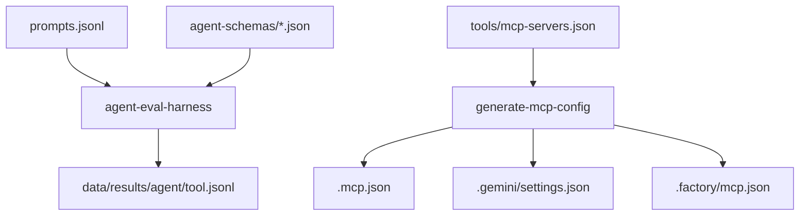

# Agentic Web Search Playoffs

Evaluate multiple agents (Claude Code, Gemini, Droid, Codex) with different web search tools (builtin, You.com MCP) in isolated Docker containers.

## Overview

The **playoffs** system runs a matrix evaluation: 4 agents × 2 tools = 8 pairings, capturing full trajectories for comparison.

**Key Features:**
- **Headless adapters** - No custom code, just JSON schemas ([@plaited/agent-eval-harness](https://www.npmjs.com/package/@plaited/agent-eval-harness))
- **Type-safe configs** - Zod schemas ensure MCP configs are correct
- **Single source of truth** - `tools/mcp-servers.json` drives all MCP config generation
- **Isolated execution** - Each pairing runs in its own Docker container
- **Transparent** - All schemas and configs are public, easily reviewable



## Quick Start

### 1. Install Dependencies

```bash
bun install
```

### 2. Set API Keys

#### Option A: Local Development (.env file)

```bash
# Copy example and edit with your keys
cp .env.example .env

# Required API keys:
# - ANTHROPIC_API_KEY=sk-ant-...     # For Claude Code agent
# - GEMINI_API_KEY=...                # For Gemini agent
# - FACTORY_API_KEY=fk-...            # For Droid agent
# - OPENAI_API_KEY=sk-...             # For Codex agent
# - YOU_API_KEY=...                   # For You.com MCP tool

# Edit .env:
nano .env
```

**Security:**
- `.env` is gitignored and never committed
- API keys are injected at runtime via Docker environment

#### Option B: CI/Server Environment Variables

For GitHub Actions, set secrets in repo settings:

```
Settings → Secrets and variables → Actions → New repository secret
```

Add each API key as a separate secret:
- `ANTHROPIC_API_KEY`
- `GEMINI_API_KEY`
- `FACTORY_API_KEY`
- `OPENAI_API_KEY`
- `YOU_API_KEY`

For other servers (AWS, GCP, etc.), use their secrets management:
- AWS: Secrets Manager or Parameter Store
- GCP: Secret Manager
- Docker: `docker run --env-file .env.production`

### 3. Run Evaluations

#### Test Workflow (5 prompts, ~5 minutes)

```bash
# Run all agents with builtin search
docker compose run --rm claude-code-builtin
docker compose run --rm gemini-builtin
docker compose run --rm droid-builtin
docker compose run --rm codex-builtin

# Run all agents with MCP search
docker compose run --rm claude-code-you
docker compose run --rm gemini-you
docker compose run --rm droid-you
docker compose run --rm codex-you
```

#### Full Workflow (1,254 prompts, ~24-32 hours)

**Run automated script:**

```bash
# Interactive script with progress tracking
./run-full-workflow.sh

# This will:
# 1. Verify docker-compose.yml uses full prompts
# 2. Run all 8 evaluations sequentially
# 3. Track elapsed time
# 4. Optionally commit results to new branch
```

**Or run individual pairings:**

```bash
# Update docker-compose.yml first
sed -i.bak 's|test.jsonl|full.jsonl|g' docker-compose.yml
sed -i.bak 's|test-mcp.jsonl|full-mcp.jsonl|g' docker-compose.yml

# Run specific agent+tool
docker compose run --rm claude-code-builtin
docker compose run --rm gemini-you

# Restore test prompts
mv docker-compose.yml.bak docker-compose.yml
```

### 4. Analyze Results

```bash
# Compare builtin vs MCP for same agent
bun run compare -- -a claude-code --toolA builtin --toolB you

# Generate summary
bunx @plaited/agent-eval-harness summarize \
  data/results/claude-code/builtin.jsonl -o summary.jsonl

# Extract tool usage statistics
cat data/results/claude-code/builtin.jsonl | \
  jq -r '.trajectory[] | select(.type == "tool_call") | .name' | \
  sort | uniq -c
```

## Architecture

### Agent Schemas (agent-schemas/)

ACP headless adapter schemas - no custom code, just JSON configuration:

| Schema | Agent | Mode | Status |
|--------|-------|------|--------|
| `claude-code.json` | Claude Code | stream | ✅ Tested |
| `gemini.json` | Gemini CLI | iterative | ✅ Tested |
| `droid.json` | Droid CLI | stream | 🔄 New |
| `codex.json` | Codex CLI | stream | 🔄 New |

**Session Modes:**
- **stream**: Process stays alive, multi-turn via stdin
- **iterative**: New process per turn, history accumulated

### MCP Tools (tools/)

Single source of truth for MCP server configurations:

```
tools/
├── mcp-servers.json    # Unified server definitions
└── schemas/            # Zod schemas (agent-specific formats)
    ├── claude-mcp.ts   # .mcp.json
    ├── gemini-mcp.ts   # .gemini/settings.json
    ├── droid-mcp.ts    # .factory/mcp.json
    └── codex-mcp.ts    # CLI commands (codex mcp add)
```

**Available Tools:**
- `builtin` - Agent's native search (no MCP config)
- `you` - You.com MCP server (requires `YOU_API_KEY`)

### CLI Scripts (scripts/)

Type-safe, manually runnable scripts:

| Script | Purpose |
|--------|---------|
| `generate-mcp-config.ts` | Generate MCP config for agent+tool |
| `run-pairing.ts` | Run single agent×tool pairing via Docker |
| `compare-results.ts` | Compare results across tools |

### Docker Infrastructure

Isolated execution for reproducibility:

```
docker/
├── base.Dockerfile           # Shared base (Bun + Node 24)
├── claude-code.Dockerfile
├── gemini.Dockerfile
├── droid.Dockerfile
├── codex.Dockerfile
├── entrypoint.sh             # Calls generate-mcp-config.ts
└── docker-compose.yml        # 8 services (4 agents × 2 tools)
```

## Prompts

| File | Description | Count |
|------|-------------|-------|
| `data/prompts/search-test.jsonl` | Search-triggering test prompts | 5 |
| `data/prompts/test.jsonl` | Original test subset | 5 |
| `data/prompts/full.jsonl` | Full evaluation set | 1,254 |

**Search prompts** are designed to trigger web search:
- Natural language questions
- Time-sensitive queries (2025, latest, current)
- Recent events (CES 2025, API pricing)

## Results

Results are written to `data/results/<agent>/<tool>.jsonl`:

```
data/results/
├── claude-code/
│   ├── builtin.jsonl
│   └── you.jsonl
├── gemini/
│   ├── builtin.jsonl
│   └── you.jsonl
├── droid/
│   ├── builtin.jsonl
│   └── you.jsonl
└── codex/
    ├── builtin.jsonl
    └── you.jsonl
```

Each result includes full trajectory (messages, tool calls, timing, token usage).

## Usage Examples

### Generate MCP Configs

```bash
# Generate config for specific agent+tool
bun run generate-mcp -- -a claude-code -t you -c /workspace

# Test generation locally
bun run generate-mcp -- -a gemini -t you -c /tmp/test
cat /tmp/test/.gemini/settings.json
```

### Run Docker Services

```bash
# Build all images
docker compose build

# Run specific pairing
docker compose run --rm claude-code-builtin
docker compose run --rm gemini-you

# Debug: Shell into container
docker compose run --rm claude-code-builtin bash
```

### Analyze Results

```bash
# Generate summary
bunx @plaited/agent-eval-harness summarize data/results/claude-code/builtin.jsonl -o summary.jsonl
bunx @plaited/agent-eval-harness summarize data/results/claude-code/you.jsonl --markdown -o summary.md

# Count tool usage
cat data/results/claude-code/builtin.jsonl | jq -r '.trajectory[] | select(.type == "tool_call") | .name' | sort | uniq -c

# Check for tool errors
cat data/results/gemini/you.jsonl | jq 'select(.toolErrors == true)'
```

## Deployment Options

### Local Development (Recommended for Testing)

**Test workflow (5 prompts, ~5 minutes):**
```bash
# Run all agents sequentially
docker compose run --rm claude-code-builtin
docker compose run --rm gemini-builtin
docker compose run --rm droid-builtin
docker compose run --rm codex-builtin
```

**Full workflow (1,254 prompts, 4-24 hours):**
```bash
# Run automated script (handles everything)
./run-full-workflow.sh
```

**Timing:**
- Sequential: ~24 hours (safest for API rate limits)
- Parallel: ~4 hours (may hit rate limits)

### GitHub Actions CI

Automatically run evaluations on code changes:

```bash
# Workflows defined in .github/workflows/playoffs.yml

# Test prompts: Runs on every PR/push
#   - 8 parallel jobs
#   - ~5 minutes total
#   - Validates changes work

# Full prompts: Manual trigger or main branch only
#   - Choose sequential (24h) or parallel (4h)
#   - Results auto-committed to new branch
#   - Creates PR for data science team
```

**Manual trigger:**
```
Actions → Playoffs Evaluation → Run workflow
  - Prompt set: full
  - Parallel: true (4h) or false (24h)
```

**Required secrets** (Settings → Secrets and variables → Actions):
- `ANTHROPIC_API_KEY`
- `GEMINI_API_KEY`
- `FACTORY_API_KEY`
- `OPENAI_API_KEY`
- `YOU_API_KEY`

### Cloud Servers (AWS, GCP, Azure)

**Option A: Long-running VM**

```bash
# Launch VM with Docker
aws ec2 run-instances --image-id ami-xxx --instance-type t3.large

# SSH and clone repo
git clone https://github.com/your-org/acp-evals.git
cd acp-evals

# Set API keys
export ANTHROPIC_API_KEY=...
export GEMINI_API_KEY=...
export FACTORY_API_KEY=...
export OPENAI_API_KEY=...
export YOU_API_KEY=...

# Run full workflow
./run-full-workflow.sh
```

**Option B: Container Service (ECS, Cloud Run, GKE)**

```bash
# Build and push Docker image
docker build -t acp-evals -f docker/base.Dockerfile .
docker tag acp-evals:latest your-registry/acp-evals:latest
docker push your-registry/acp-evals:latest

# Deploy with secrets from secrets manager
# Results are committed back to repo automatically
```

### Recommendations

| Environment | Prompt Set | Mode | Time | Best For |
|-------------|------------|------|------|----------|
| **Local Dev** | test | - | 5 min | Validating changes |
| **Local Dev** | full | sequential | 24h | First full run, debugging |
| **GitHub Actions** | test | parallel | 5 min | PR validation (automated) |
| **GitHub Actions** | full | parallel | 4h | Quick results, sufficient API quota |
| **Cloud Server** | full | sequential | 24h | Cost-effective, limited quota |
| **Cloud Server** | full | parallel | 4h | Fast results, high quota |

**API Rate Limit Considerations:**
- **Parallel (4h):** Requires high API quota, 8 concurrent requests
- **Sequential (24h):** Works with standard quotas, 1 request at a time

**Cost Estimates (approximate):**
- API calls: ~10,000 requests total (1,254 prompts × 8 runs)
- Anthropic Claude: $50-100
- Google Gemini: $20-40
- OpenAI Codex: $30-60
- Factory Droid: $20-40
- You.com MCP: $10-20
- **Total:** ~$130-260 per full evaluation

## Adding Agents

1. **Create adapter schema** (`agent-schemas/<agent>.json`)
   - Test CLI: `<agent> --help`
   - Map JSON events to ACP
   - Test: `bunx @plaited/agent-eval-harness adapter:check -- bunx @plaited/agent-eval-harness headless --schema agent-schemas/<agent>.json`

2. **Create MCP schema** (`tools/schemas/<agent>-mcp.ts`)
   - Research config location
   - Export Zod schema + path constant
   - Export `generate<Agent>Config` function

3. **Update generate-mcp-config.ts**
   - Import schema
   - Add to `AGENTS` array
   - Add switch case

4. **Create Dockerfile** (`docker/<agent>.Dockerfile`)
   - Install CLI
   - Copy entrypoint

5. **Add Docker Compose services**
   - `<agent>-builtin`
   - `<agent>-you`

See `.claude/skills/playoffs/SKILL.md` for detailed scaffolding guide.

## Adding MCP Tools

1. **Add to tools/mcp-servers.json**
   ```json
   {
     "servers": {
       "new-tool": {
         "name": "tool-name",
         "type": "http",
         "url": "https://api.example.com/mcp",
         "auth": { "type": "bearer", "envVar": "NEW_TOOL_API_KEY" }
       }
     }
   }
   ```

2. **Update generate-mcp-config.ts**
   - Add to `TOOLS` array

3. **Update .env and .env.example**
   ```
   NEW_TOOL_API_KEY=...
   ```

4. **Add Docker Compose services**
   - Add `<agent>-<tool>` for each agent

## Troubleshooting

### MCP Config Issues

1. **Test config generation**
   ```bash
   bun run generate-mcp -- -a <agent> -t <tool> -c /tmp/test
   ls /tmp/test/.mcp.json  # Claude
   ls /tmp/test/.gemini/settings.json  # Gemini
   ls /tmp/test/.factory/mcp.json  # Droid
   ```

2. **Verify API keys**
   ```bash
   cat .env | grep API_KEY
   ```

3. **Test inside container**
   ```bash
   docker compose run --rm <agent>-<tool> bash -c "cat /workspace/.mcp.json"
   ```

### Agent Schema Issues

1. **Capture raw CLI output**
   ```bash
   <agent> --help
   <agent> "test prompt" --output-format stream-json | head -20
   ```

2. **Test adapter compliance**
   ```bash
   bunx @plaited/agent-eval-harness adapter:check -- \
     bunx @plaited/agent-eval-harness headless --schema agent-schemas/<agent>.json
   ```

### Docker Build Failures

1. **Check base image**
   ```bash
   docker build -t base -f docker/base.Dockerfile .
   docker run --rm base bun --version
   ```

2. **Check agent CLI**
   ```bash
   docker build -t test-<agent> -f docker/<agent>.Dockerfile .
   docker run --rm test-<agent> <agent> --version
   ```

## Project Structure

```
acp-evals/
├── agent-schemas/          # ACP headless schemas (public)
│   ├── claude-code.json
│   ├── gemini.json
│   ├── droid.json
│   ├── codex.json
│   └── README.md
│
├── tools/                  # MCP configs (single source of truth)
│   ├── mcp-servers.json    # Unified server definitions
│   ├── schemas/            # Zod schemas per agent
│   └── README.md
│
├── scripts/                # CLI tools (type-safe, testable)
│   ├── generate-mcp-config.ts
│   ├── run-pairing.ts
│   └── compare-results.ts
│
├── docker/                 # Container infrastructure
│   ├── base.Dockerfile
│   ├── claude-code.Dockerfile
│   ├── gemini.Dockerfile
│   ├── droid.Dockerfile
│   ├── entrypoint.sh
│   └── docker-compose.yml
│
├── data/
│   ├── prompts/            # Evaluation prompts
│   │   ├── search-test.jsonl
│   │   ├── test.jsonl
│   │   └── full.jsonl
│   └── results/            # Agent outputs (gitignored)
│
├── .claude/skills/playoffs/  # Development assistant skill
└── .env                      # API keys (gitignored)
```

## Development

### Code Quality

```bash
# Type check
bun run typecheck

# Lint and format
bun run check

# Auto-fix
bun run check:write

# Run tests
bun test
```

### Skills

This project uses [AgentSkills](https://agentskills.io) for agent-first development:

- **playoffs** (`.claude/skills/playoffs/`) - Development assistant for extending playoffs
- **acp-adapters** - Schema creation and adapter testing
- **agent-eval-harness** - Capture, trials, and analysis commands

See [@AGENTS.md](AGENTS.md) for development rules and conventions.

## Built With

- **[@plaited/agent-eval-harness](https://www.npmjs.com/package/@plaited/agent-eval-harness)** - Trajectory capture framework
- **[Zod](https://zod.dev)** - TypeScript-first schema validation
- **[Bun](https://bun.sh)** - Fast TypeScript runtime
- **[Docker](https://www.docker.com)** - Isolated execution

## References

- [Agent Client Protocol](https://agentclientprotocol.com/) - Protocol specification
- [Model Context Protocol](https://modelcontextprotocol.io/) - MCP specification
- [AgentSkills Spec](https://agentskills.io) - Agent skill conventions
- [Factory AI](https://factory.ai/) - Droid's platform
