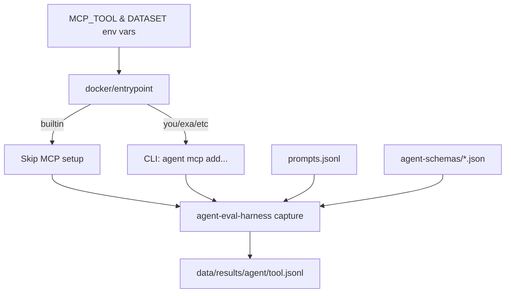

# Agentic Web Search Playoffs

Evaluate multiple agents (Claude Code, Gemini, Droid, Codex) with different web search tools (builtin, You.com MCP) in isolated Docker containers.

## Overview

The **playoffs** system runs a matrix evaluation: 4 agents × 2 tools = 8 pairings, capturing full trajectories for comparison.

**Key Features:**
- **Headless adapters** - No custom code, just JSON schemas ([@plaited/agent-eval-harness](https://www.npmjs.com/package/@plaited/agent-eval-harness))
- **Flag-based architecture** - Single service per agent, MCP mode selected via environment variable
- **Type-safe constants** - TypeScript MCP server definitions in `mcp-servers.ts`
- **CLI-based MCP setup** - Agents configure MCP via official CLI commands at runtime
- **Isolated execution** - Each pairing runs in its own Docker container
- **Transparent** - All schemas and configs are public, easily reviewable



## Quick Start

### 1. Install Dependencies

```bash
bun install
```

### 2. Set API Keys

#### Option A: Local Development (.env file)

```bash
# Copy example and edit with your keys
cp .env.example .env

# Required API keys:
# - ANTHROPIC_API_KEY=sk-ant-...     # For Claude Code agent
# - GEMINI_API_KEY=...                # For Gemini agent
# - FACTORY_API_KEY=fk-...            # For Droid agent
# - OPENAI_API_KEY=sk-...             # For Codex agent
# - YOU_API_KEY=...                   # For You.com MCP tool

# Edit .env:
nano .env
```

**Security:**
- `.env` is gitignored and never committed
- API keys are injected at runtime via Docker environment

#### Option B: CI/Server Environment Variables

For GitHub Actions, set secrets in repo settings:

```
Settings → Secrets and variables → Actions → New repository secret
```

Add each API key as a separate secret:
- `ANTHROPIC_API_KEY`
- `GEMINI_API_KEY`
- `FACTORY_API_KEY`
- `OPENAI_API_KEY`
- `YOU_API_KEY`

For other servers (AWS, GCP, etc.), use their secrets management:
- AWS: Secrets Manager or Parameter Store
- GCP: Secret Manager
- Docker: `docker run --env-file .env.production`

### 3. Run Evaluations

#### Test Workflow (5 prompts, ~5 minutes)

```bash
# Run all agents with builtin search
docker compose run --rm -e MCP_TOOL=builtin claude-code
docker compose run --rm -e MCP_TOOL=builtin gemini
docker compose run --rm -e MCP_TOOL=builtin droid
docker compose run --rm -e MCP_TOOL=builtin codex

# Run all agents with You.com MCP search
docker compose run --rm -e MCP_TOOL=you claude-code
docker compose run --rm -e MCP_TOOL=you gemini
docker compose run --rm -e MCP_TOOL=you droid
docker compose run --rm -e MCP_TOOL=you codex

# Or use the automated script (runs all 8 scenarios in parallel)
bun run run
```

#### Full Workflow (1,254 prompts, ~24-32 hours)

**Run automated script:**

```bash
# Run all agents with full dataset (uses DATASET=full env var)
bun run run:full

# Or run specific MCP mode only
bun run run:full -- --mcp builtin
bun run run:full -- --mcp you
```

**Or run individual agents:**

```bash
# Use DATASET=full environment variable
docker compose run --rm -e MCP_TOOL=builtin -e DATASET=full claude-code
docker compose run --rm -e MCP_TOOL=you -e DATASET=full gemini
docker compose run --rm -e MCP_TOOL=builtin -e DATASET=full droid
docker compose run --rm -e MCP_TOOL=you -e DATASET=full codex
```

### 4. Analyze Results

```bash
# Compare all 8 result files (all agents × both configs)
bun run compare:all-weighted          # Weighted: quality + latency + reliability
bun run compare:all-statistical       # Statistical: bootstrap with confidence intervals

# Compare agents on builtin config only
bun run compare:builtin-agents        # Which agent is best without MCP

# Compare agents on You.com MCP config only
bun run compare:you-agents            # Which agent is best with MCP

# Custom weights (quality=70%, latency=20%, reliability=10%)
COMPARE_QUALITY=0.7 COMPARE_LATENCY=0.2 COMPARE_RELIABILITY=0.1 \
  bun run compare:all-weighted

# View comparison results
cat data/comparison-all-weighted.json | jq '.meta, .quality'
cat data/comparison-all-weighted.json | jq '.headToHead.pairwise'

# Generate summary for individual results
bunx @plaited/agent-eval-harness summarize \
  data/results/claude-code/builtin-test.jsonl -o summary.jsonl

# Extract tool usage statistics
cat data/results/claude-code/builtin-test.jsonl | \
  jq -r '.trajectory[] | select(.type == "tool_call") | .name' | \
  sort | uniq -c
```

## Running Evaluations Locally

This section provides detailed guidance for running evaluations on your local machine.

### Prerequisites

- **Bun** >= 1.2.9 (package manager and runtime)
- **Docker** (for isolated agent execution)
- **API Keys** (see Quick Start section above)
- **Agent CLI** (Claude Code, Cursor, or similar recommended for development)

### Test vs Full Evaluations

The project includes two prompt sets:

| Prompt Set | Count | Purpose | Time (all agents) |
|------------|-------|---------|-------------------|
| **test.jsonl** / **test-mcp.jsonl** | 5 | Quick validation, PR checks | ~5 minutes |
| **full.jsonl** / **full-mcp.jsonl** | 1,254 | Production data, complete analysis | ~24-32 hours |

### Running Test Evaluations

**Single agent+tool pairing:**
```bash
# Test with builtin search
docker compose run --rm -e MCP_TOOL=builtin claude-code

# Test with MCP search
docker compose run --rm -e MCP_TOOL=you claude-code
```

**All agents (using automated script):**
```bash
bun run run
```

### Running Full Evaluations

Full evaluations run 1,254 prompts per agent. This takes significant time and API quota.

**Use the automated script:**

```bash
# Run all agents with full dataset
bun run run:full

# Or run specific MCP mode only
bun run run:full -- --mcp builtin
bun run run:full -- --mcp you
```

**Or run individual agents manually:**

```bash
# Use DATASET=full environment variable
docker compose run --rm -e MCP_TOOL=builtin -e DATASET=full claude-code
docker compose run --rm -e MCP_TOOL=you -e DATASET=full gemini
docker compose run --rm -e MCP_TOOL=builtin -e DATASET=full droid
docker compose run --rm -e MCP_TOOL=you -e DATASET=full codex
```

**How it works:** The `DATASET` environment variable (default: `test`) controls which prompt file is used. The entrypoint script automatically selects:
- `DATASET=test` → `test.jsonl` / `test-mcp.jsonl` (5 prompts)
- `DATASET=full` → `full.jsonl` / `full-mcp.jsonl` (1,254 prompts)

### Comparing Results

After running evaluations, compare agent performance using built-in comparison scripts:

```bash
# Compare all 8 result files with weighted strategy
bun run compare:all-weighted

# Compare all 8 result files with statistical significance testing
bun run compare:all-statistical

# Compare agents on builtin config only
bun run compare:builtin-agents

# Compare agents on You.com MCP config only
bun run compare:you-agents

# Customize weights for weighted comparison
COMPARE_QUALITY=0.7 COMPARE_LATENCY=0.2 COMPARE_RELIABILITY=0.1 \
  bun run compare:all-weighted

# View comparison results
cat data/comparison-all-weighted.json | jq '.meta, .quality'
cat data/comparison-all-weighted.json | jq '.headToHead.pairwise'
```

**Comparison strategies:**
- **Weighted**: Combines quality (from inline grader), latency, and reliability with configurable weights
- **Statistical**: Bootstrap sampling (1000 iterations) with confidence intervals and significance testing

### Pass@k Analysis

Run multiple trials per prompt to measure agent reliability:

```bash
# Default: Droid agent, test set, k=5
bun run trials

# Capability exploration (k=10)
bun run trials:capability

# Regression safety (k=3, faster)
bun run trials:regression

# Custom: specify agent and k value
bun run trials -- --agent gemini -k 7

# View metrics
cat data/results/trials/droid-test.jsonl | jq '{id, passRate, passAtK, passExpK}'
```

**Metrics:** `passAtK` = capability (can do task?), `passExpK` = reliability (always succeeds?)

## Grading & Validation

Grading is a core part of evaluation - it provides the pass/fail logic that measures agent success. This project supports two grading patterns:

### Grader Types

| Type | Use Case | When to Use |
|------|----------|-------------|
| **Single-run grader** | Pass/fail scoring for one agent run | Inline evaluation with `--grader` flag |
| **Comparison grader** | Ranking multiple runs for the same prompt | Post-hoc comparison with `compare` script |

### Built-in Comparison Graders

The project uses built-in comparison graders from `@plaited/agent-eval-harness`:

**Weighted Grader:**
- Combines quality (from inline grader score), latency, and reliability
- Default weights: quality=0.5, latency=0.3, reliability=0.2
- Configurable via environment variables

**Statistical Grader:**
- Bootstrap sampling (1000 iterations by default)
- Confidence intervals and significance testing (p<0.05)
- Detects when differences are statistically significant

**Usage:**
```bash
# Weighted comparison with default weights
bun run compare:all-weighted

# Weighted comparison with custom weights
COMPARE_QUALITY=0.7 COMPARE_LATENCY=0.2 COMPARE_RELIABILITY=0.1 \
  bun run compare:all-weighted

# Statistical comparison with significance testing
bun run compare:all-statistical

# View results
cat data/comparison-all-weighted.json | jq '.quality, .headToHead'
```

**Quality scores** come from the inline grader (deterministic + LLM), which must be run during evaluation using the `--grader` flag.

### Writing Custom Single-Run Graders

For inline evaluation (pass/fail on each prompt), create a single-run grader:

**TypeScript example:**
```typescript
// scripts/my-grader.ts
import type { Grader } from '@plaited/agent-eval-harness/schemas'

export const grade: Grader = async ({ input, output, hint, trajectory }) => {
  // Check if output contains expected content
  const pass = output.toLowerCase().includes(hint?.toLowerCase() ?? '')
  
  return {
    pass,
    score: pass ? 1 : 0,
    reasoning: pass ? 'Contains expected content' : 'Missing expected content'
  }
}
```

**Python example:**
```python
#!/usr/bin/env python3
# scripts/my-grader.py
import json
import sys

data = json.load(sys.stdin)
output = data.get("output", "").lower()
hint = (data.get("hint") or "").lower()

pass_result = hint in output if hint else True
print(json.dumps({
    "pass": pass_result,
    "score": 1.0 if pass_result else 0.0,
    "reasoning": "Contains hint" if pass_result else "Missing hint"
}))
```

### Using Custom Graders

**With capture command (inline grading):**
```bash
bunx @plaited/agent-eval-harness capture \
  data/prompts/test.jsonl \
  --schema agent-schemas/claude-code.json \
  --grader ./scripts/my-grader.ts \
  -o data/results/graded.jsonl
```

**With trials command (pass@k analysis):**
```bash
bunx @plaited/agent-eval-harness trials \
  data/prompts/test.jsonl \
  --schema agent-schemas/claude-code.json \
  -k 5 \
  --grader ./scripts/my-grader.ts \
  -o data/results/trials.jsonl
```

### Grader Validation Workflow

Before trusting your grader, validate it against reference solutions:

**Step 1: Create reference prompts**
```bash
echo '{"id":"test-1","input":"Find the CEO of Anthropic","reference":"Dario Amodei","hint":"Dario Amodei"}' > test-refs.jsonl
```

**Step 2: Validate grader**
```bash
bunx @plaited/agent-eval-harness validate-refs \
  test-refs.jsonl \
  --grader ./scripts/my-grader.ts \
  -o validation.jsonl
```

**Step 3: Check for failures**
```bash
# If your reference solutions fail, you have a grader bug
cat validation.jsonl | jq 'select(.pass == false)'
```

### Grader Calibration

**Why calibrate:** Graders can be too strict (rejecting valid solutions) or too lenient (accepting invalid ones). Calibration catches:

- **Grader bugs** - Rejecting valid solutions
- **Task definition issues** - Ambiguous requirements
- **Agent vs grader failures** - Distinguishing real failures from grader mistakes

**Calibration workflow:**

```bash
# 1. Run evaluation with grading
bunx @plaited/agent-eval-harness capture \
  data/prompts/test.jsonl \
  --schema agent-schemas/claude-code.json \
  --grader ./scripts/my-grader.ts \
  -o results.jsonl

# 2. Sample failures for human review
bunx @plaited/agent-eval-harness calibrate \
  results.jsonl \
  --sample 10 \
  -o calibration.md

# 3. Review calibration.md manually
# 4. Fix grader bugs or clarify task definitions
# 5. Re-run validation and evaluation
```

### Best Practices

**From Anthropic's eval guide:**
- ✅ **Validate first**: Test grader against reference solutions before evaluating agents
- ✅ **Read transcripts**: Manually review failures to catch unfair grading
- ✅ **Calibrate regularly**: Compare grader scores against human judgment
- ✅ **Provide escape hatch**: LLM judges should have "Unknown" option to avoid hallucinations
- ✅ **Balance test sets**: Include both positive (should succeed) and negative (should fail) cases

**See also:** [Anthropic's eval guide](https://www.anthropic.com/engineering/demystifying-evals-for-ai-agents) for comprehensive evaluation best practices.

## Architecture

### Agent Schemas (agent-schemas/)

ACP headless adapter schemas - no custom code, just JSON configuration:

| Schema | Agent | Mode | Status |
|--------|-------|------|--------|
| `claude-code.json` | Claude Code | stream | ✅ Tested |
| `gemini.json` | Gemini CLI | iterative | ✅ Tested |
| `droid.json` | Droid CLI | stream | 🔄 New |
| `codex.json` | Codex CLI | stream | 🔄 New |

**Session Modes:**
- **stream**: Process stays alive, multi-turn via stdin
- **iterative**: New process per turn, history accumulated

### MCP Tools (tools/)

Single source of truth for MCP server configurations:

```
tools/
├── mcp-servers.json    # Unified server definitions
└── schemas/            # Zod schemas (agent-specific formats)
    ├── claude-mcp.ts   # .mcp.json
    ├── gemini-mcp.ts   # .gemini/settings.json
    ├── droid-mcp.ts    # .factory/mcp.json
    └── codex-mcp.ts    # CLI commands (codex mcp add)
```

**Available Tools:**
- `builtin` - Agent's native search (no MCP config)
- `you` - You.com MCP server (requires `YOU_API_KEY`)

### CLI Scripts (scripts/)

Type-safe, manually runnable scripts:

| Script | Purpose |
|--------|---------|
| `generate-mcp-config.ts` | Generate MCP config for agent+tool |
| `run-pairing.ts` | Run single agent×tool pairing via Docker |
| `compare-results.ts` | Compare results across tools |

### Docker Infrastructure

Isolated execution for reproducibility:

```
docker/
├── base.Dockerfile           # Shared base (Bun + Node 24)
├── claude-code.Dockerfile
├── gemini.Dockerfile
├── droid.Dockerfile
├── codex.Dockerfile
├── entrypoint.sh             # Calls generate-mcp-config.ts
└── docker-compose.yml        # 8 services (4 agents × 2 tools)
```

## Prompts

| File | Description | Count |
|------|-------------|-------|
| `data/prompts/search-test.jsonl` | Search-triggering test prompts | 5 |
| `data/prompts/test.jsonl` | Original test subset | 5 |
| `data/prompts/full.jsonl` | Full evaluation set | 1,254 |

**Search prompts** are designed to trigger web search:
- Natural language questions
- Time-sensitive queries (2025, latest, current)
- Recent events (CES 2025, API pricing)

## Results

Results are written to `data/results/<agent>/<tool>.jsonl`:

```
data/results/
├── claude-code/
│   ├── builtin.jsonl
│   └── you.jsonl
├── gemini/
│   ├── builtin.jsonl
│   └── you.jsonl
├── droid/
│   ├── builtin.jsonl
│   └── you.jsonl
└── codex/
    ├── builtin.jsonl
    └── you.jsonl
```

Each result includes full trajectory (messages, tool calls, timing, token usage).

## Usage Examples

### Generate MCP Configs

```bash
# Generate config for specific agent+tool
bun run generate-mcp -- -a claude-code -t you -c /workspace

# Test generation locally
bun run generate-mcp -- -a gemini -t you -c /tmp/test
cat /tmp/test/.gemini/settings.json
```

### Run Docker Services

```bash
# Build all images
bun run build

# Run specific agent+tool combination
docker compose run --rm -e MCP_TOOL=builtin claude-code
docker compose run --rm -e MCP_TOOL=you gemini

# Debug: Shell into container
docker compose run --rm -e MCP_TOOL=builtin claude-code bash
```

### Analyze Results

```bash
# Compare all agents and configurations
bun run compare:all-weighted          # Weighted comparison
bun run compare:all-statistical       # Statistical significance testing

# Compare specific subsets
bun run compare:builtin-agents        # Builtin config only
bun run compare:you-agents            # You.com MCP config only

# View comparison results
cat data/comparison-all-weighted.json | jq '.meta, .quality'
cat data/comparison-all-weighted.json | jq '.headToHead.pairwise'

# Generate summary for individual results
bunx @plaited/agent-eval-harness summarize data/results/claude-code/builtin-test.jsonl -o summary.jsonl
bunx @plaited/agent-eval-harness summarize data/results/claude-code/you-test.jsonl --markdown -o summary.md

# Count tool usage
cat data/results/claude-code/builtin-test.jsonl | jq -r '.trajectory[] | select(.type == "tool_call") | .name' | sort | uniq -c

# Check for tool errors
cat data/results/gemini/you-test.jsonl | jq 'select(.toolErrors == true)'
```

## Deployment Options

### Local Development (Recommended for Testing)

**Test workflow (5 prompts, ~5 minutes):**
```bash
# Run all agents in parallel
bun run run

# Or run specific agent with both MCP modes
docker compose run --rm -e MCP_TOOL=builtin claude-code
docker compose run --rm -e MCP_TOOL=you claude-code
```

**Full workflow (1,254 prompts, 4-24 hours):**
```bash
# Run automated script (handles everything)
bun run run:full
```

**Timing:**
- Sequential: ~24 hours (safest for API rate limits)
- Parallel: ~4 hours (may hit rate limits)

### GitHub Actions CI

Automatically run evaluations on code changes:

```bash
# Workflows defined in .github/workflows/playoffs.yml

# Test prompts: Runs on every PR/push
#   - 8 parallel jobs
#   - ~5 minutes total
#   - Validates changes work

# Full prompts: Manual trigger or main branch only
#   - Choose sequential (24h) or parallel (4h)
#   - Results auto-committed to new branch
#   - Creates PR for data science team
```

**Manual trigger:**
```
Actions → Playoffs Evaluation → Run workflow
  - Prompt set: full
  - Parallel: true (4h) or false (24h)
```

**Required secrets** (Settings → Secrets and variables → Actions):
- `ANTHROPIC_API_KEY`
- `GEMINI_API_KEY`
- `FACTORY_API_KEY`
- `OPENAI_API_KEY`
- `YOU_API_KEY`

### Cloud Servers (AWS, GCP, Azure)

**Option A: Long-running VM**

```bash
# Launch VM with Docker
aws ec2 run-instances --image-id ami-xxx --instance-type t3.large

# SSH and clone repo
git clone https://github.com/your-org/acp-evals.git
cd acp-evals

# Set API keys
export ANTHROPIC_API_KEY=...
export GEMINI_API_KEY=...
export FACTORY_API_KEY=...
export OPENAI_API_KEY=...
export YOU_API_KEY=...

# Run full workflow
./run-full-workflow.sh
```

**Option B: Container Service (ECS, Cloud Run, GKE)**

```bash
# Build and push Docker image
docker build -t acp-evals -f docker/base.Dockerfile .
docker tag acp-evals:latest your-registry/acp-evals:latest
docker push your-registry/acp-evals:latest

# Deploy with secrets from secrets manager
# Results are committed back to repo automatically
```

### Recommendations

| Environment | Prompt Set | Mode | Time | Best For |
|-------------|------------|------|------|----------|
| **Local Dev** | test | - | 5 min | Validating changes |
| **Local Dev** | full | sequential | 24h | First full run, debugging |
| **GitHub Actions** | test | parallel | 5 min | PR validation (automated) |
| **GitHub Actions** | full | parallel | 4h | Quick results, sufficient API quota |
| **Cloud Server** | full | sequential | 24h | Cost-effective, limited quota |
| **Cloud Server** | full | parallel | 4h | Fast results, high quota |

**API Rate Limit Considerations:**
- **Parallel (4h):** Requires high API quota, 8 concurrent requests
- **Sequential (24h):** Works with standard quotas, 1 request at a time

**Cost Estimates (approximate):**
- API calls: ~10,000 requests total (1,254 prompts × 8 runs)
- Anthropic Claude: $50-100
- Google Gemini: $20-40
- OpenAI Codex: $30-60
- Factory Droid: $20-40
- You.com MCP: $10-20
- **Total:** ~$130-260 per full evaluation

## Adding Agents

1. **Create adapter schema** (`agent-schemas/<agent>.json`)
   - Test CLI: `<agent> --help`
   - Map JSON events to ACP
   - Test: `bunx @plaited/agent-eval-harness adapter:check -- bunx @plaited/agent-eval-harness headless --schema agent-schemas/<agent>.json`

2. **Create MCP schema** (`tools/schemas/<agent>-mcp.ts`)
   - Research config location
   - Export Zod schema + path constant
   - Export `generate<Agent>Config` function

3. **Update generate-mcp-config.ts**
   - Import schema
   - Add to `AGENTS` array
   - Add switch case

4. **Create Dockerfile** (`docker/<agent>.Dockerfile`)
   - Install CLI
   - Copy entrypoint

5. **Add Docker Compose services**
   - `<agent>-builtin`
   - `<agent>-you`

See `.claude/skills/playoffs/SKILL.md` for detailed scaffolding guide.

## Adding MCP Tools

1. **Add to mcp-servers.ts**
   ```typescript
   export const MCP_SERVERS = {
     you: { /* ... */ },
     exa: {
       name: 'exa-server',
       type: 'http' as const,
       url: 'https://api.exa.ai/mcp',
       auth: {
         type: 'bearer' as const,
         envVar: 'EXA_API_KEY',
       },
     },
   } as const;
   ```

2. **Update docker/entrypoint**
   - Add `exa` case to `configureMcp()` function for each agent

3. **Update .env and .env.example**
   ```
   EXA_API_KEY=...
   ```

4. **Update scripts/run.ts**
   - Add `"exa"` to `McpTool` type union

5. **Create MCP prompt set**
   - Copy existing MCP prompts and update server name:
   ```bash
   sed 's/mcp-server="ydc-server"/mcp-server="exa-server"/g' \
     data/prompts/test-mcp.jsonl > data/prompts/test-exa.jsonl
   ```

See `.claude/skills/playoffs/references/mcp-tools.md` for detailed guide.

## Troubleshooting

### MCP Config Issues

1. **Test config generation**
   ```bash
   bun run generate-mcp -- -a <agent> -t <tool> -c /tmp/test
   ls /tmp/test/.mcp.json  # Claude
   ls /tmp/test/.gemini/settings.json  # Gemini
   ls /tmp/test/.factory/mcp.json  # Droid
   ```

2. **Verify API keys**
   ```bash
   cat .env | grep API_KEY
   ```

3. **Test inside container**
   ```bash
   docker compose run --rm -e MCP_TOOL=you <agent> bash -c "cat /workspace/.mcp.json"
   ```

### Agent Schema Issues

1. **Capture raw CLI output**
   ```bash
   <agent> --help
   <agent> "test prompt" --output-format stream-json | head -20
   ```

2. **Test adapter compliance**
   ```bash
   bunx @plaited/agent-eval-harness adapter:check -- \
     bunx @plaited/agent-eval-harness headless --schema agent-schemas/<agent>.json
   ```

### Docker Build Failures

1. **Check base image**
   ```bash
   docker build -t base -f docker/base.Dockerfile .
   docker run --rm base bun --version
   ```

2. **Check agent CLI**
   ```bash
   docker build -t test-<agent> -f docker/<agent>.Dockerfile .
   docker run --rm test-<agent> <agent> --version
   ```

## Project Structure

```
acp-evals/
├── agent-schemas/          # ACP headless schemas (public)
│   ├── claude-code.json
│   ├── gemini.json
│   ├── droid.json
│   ├── codex.json
│   └── README.md
│
├── tools/                  # MCP configuration
│   └── mcp-servers.ts      # TypeScript constants (single source)
│
├── scripts/                # CLI tools (type-safe, testable)
│   ├── run.ts              # Automated test runner
│   ├── compare.ts          # Results comparison
│   ├── inline-grader.ts    # Hybrid grader with LLM scoring
│   └── comparison-grader.ts # Comparison grader for A/B testing
│
├── docker/                 # Container infrastructure
│   ├── base.Dockerfile
│   ├── claude-code.Dockerfile
│   ├── gemini.Dockerfile
│   ├── droid.Dockerfile
│   ├── codex.Dockerfile
│   ├── entrypoint          # TypeScript entrypoint (Bun shell)
│   └── docker-compose.yml  # 4 services (one per agent)
│
├── data/
│   ├── prompts/            # Evaluation prompts
│   │   ├── test.jsonl              # 5 builtin prompts
│   │   ├── test-mcp.jsonl          # 5 MCP prompts
│   │   ├── full.jsonl              # 1,254 builtin prompts
│   │   └── full-mcp.jsonl          # 1,254 MCP prompts
│   └── results/            # Agent outputs (committed for analysis)
│
├── .claude/skills/playoffs/  # Development assistant skill
└── .env                      # API keys (gitignored)
```

## Development

### Code Quality

```bash
# Type check
bun run typecheck

# Lint and format
bun run check

# Auto-fix
bun run check:write

# Run tests
bun test
```

### Skills

This project uses [AgentSkills](https://agentskills.io) for agent-first development:

- **playoffs** (`.claude/skills/playoffs/`) - Development assistant for extending playoffs
- **acp-adapters** - Schema creation and adapter testing
- **agent-eval-harness** - Capture, trials, and analysis commands

See [@AGENTS.md](AGENTS.md) for development rules and conventions.

## Built With

- **[@plaited/agent-eval-harness](https://www.npmjs.com/package/@plaited/agent-eval-harness)** - Trajectory capture framework
- **[Zod](https://zod.dev)** - TypeScript-first schema validation
- **[Bun](https://bun.sh)** - Fast TypeScript runtime
- **[Docker](https://www.docker.com)** - Isolated execution

## References

- [Agent Client Protocol](https://agentclientprotocol.com/) - Protocol specification
- [Model Context Protocol](https://modelcontextprotocol.io/) - MCP specification
- [AgentSkills Spec](https://agentskills.io) - Agent skill conventions
- [Factory AI](https://factory.ai/) - Droid's platform
